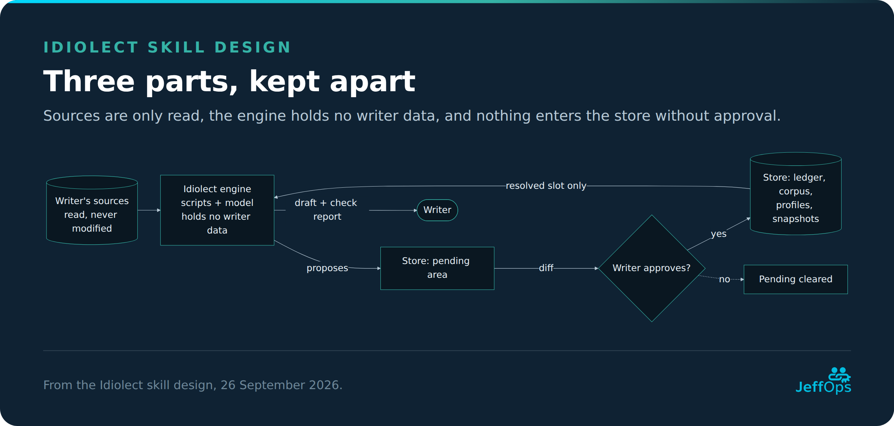

# Idiolect

A Claude skill that learns a writer's voice from their own texts and writes, rewrites and checks
text in that voice.

Idiolect is an empty engine. The skill holds the method only. What it learns lives in a separate
folder the writer chooses (the *store*), and nothing is learned without the writer approving a diff.

> **Status: all build phases done (0 to 6).** The skill finds or creates a store, learns a voice from
> Markdown, PDF and Word files with the writer's approval (ownership, fingerprints, contrast with
> neutral AI rewrites, lessons with stable ids, vocabulary, redacted examples), supports
> `forget`, `rollback`, `prune` and `status`, writes, rewrites and checks text in a learned voice, and
> tests a profile against a held-out text of the writer's own (`test`, with an optional blind judge),
> learns from the writer's edits to a draft (`learn-edit`), builds a slot from interview answers, reads
> exported mail (`.eml`, `.msg`), web pages, Microsoft 365 sent mail and talk transcripts, exports a
> voice as one prompt for another tool, gates other skills' publishing through `check`, and runs from a
> cloud session bridged to the writer's computer. It can add a facet such as `channel` to a store.
> In blind evaluation it beat few-shot prompting on synthetic authors, not on well-known real ones;
> a writer's own blind test is available but has not been run. Fixture authors are learned in `evals/store/`.

## Try it

```
python3 -m pip install PyYAML jsonschema markdown-it-py pdfminer.six lingua-language-detector
python3 idiolect/scripts/check_env.py
python3 idiolect/scripts/inventory.py --sources ~/Writing --dry-run      # no store needed
python3 -m pytest tests -q                                               # the test suite
python3 tools/build_package.py                                           # builds idiolect.skill
```

## Why "Idiolect"

An idiolect is the linguistic term for one person's own way of using a language. That is exactly
what this skill learns, and nothing else.

## What it will do

- **Learn** from Markdown, PDF and Word files, a folder or a tag, and later from mail, web pages and
  transcripts. Only texts the writer marks as their own are used.
- **Keep lessons** in the writer's store, split into profiles (one per voice) and slots (per
  language and text type). Every change is shown as a diff first and can be rolled back.
- **Write and rewrite** from the learned profile and a few real example passages, without inventing
  facts.
- **Check** a draft against the writer's measured style, flagging both too little and too much of a
  habit.
- **Prove itself** in blind tests against a plain draft and against a draft given the same examples.

## Repository layout

```
docs/          design document, diagrams and their editable sources
idiolect/      the skill itself (SKILL.md, scripts, references, assets) — packaged as idiolect.skill
evals/         evaluation protocol, fixture texts, edit pairs, experiments — not shipped with the skill
```

## Design

The full design is in [docs/design.md](docs/design.md). Start with the architecture:



## Build plan

| Phase | What |
| --- | --- |
| 0 | Groundwork: schemas, rules, fixtures, metric experiment, evaluation protocol |
| 1 | Engine: store discovery, inventory, ledger, adapters, measurement |
| 2 | Learning: lessons, approval, snapshots, rollback |
| 3 | Writing: write, rewrite, check, evaluation |
| 4 | Validation: `test` |
| 5 | Feedback: learn-edit, interview, more facets, inheritance |
| 6 | Reach: cloud route, export, more adapters, use from other skills |

## Licence

MIT, see [LICENSE](LICENSE).
