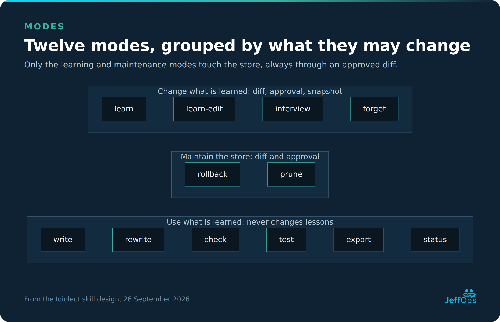
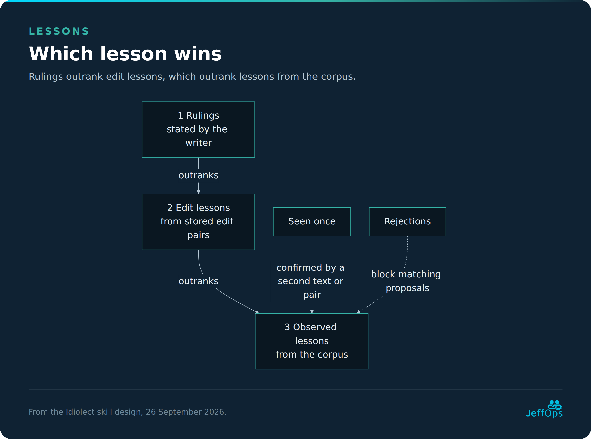
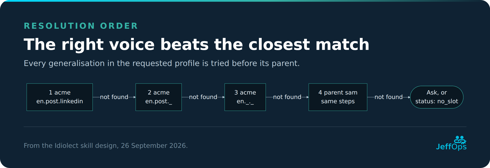
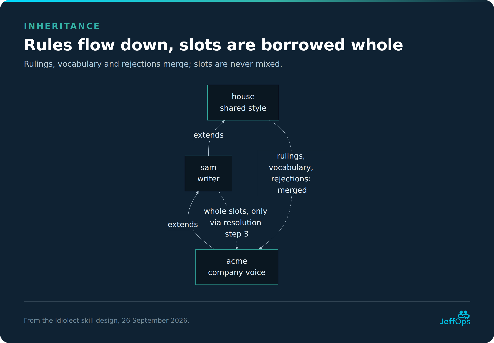
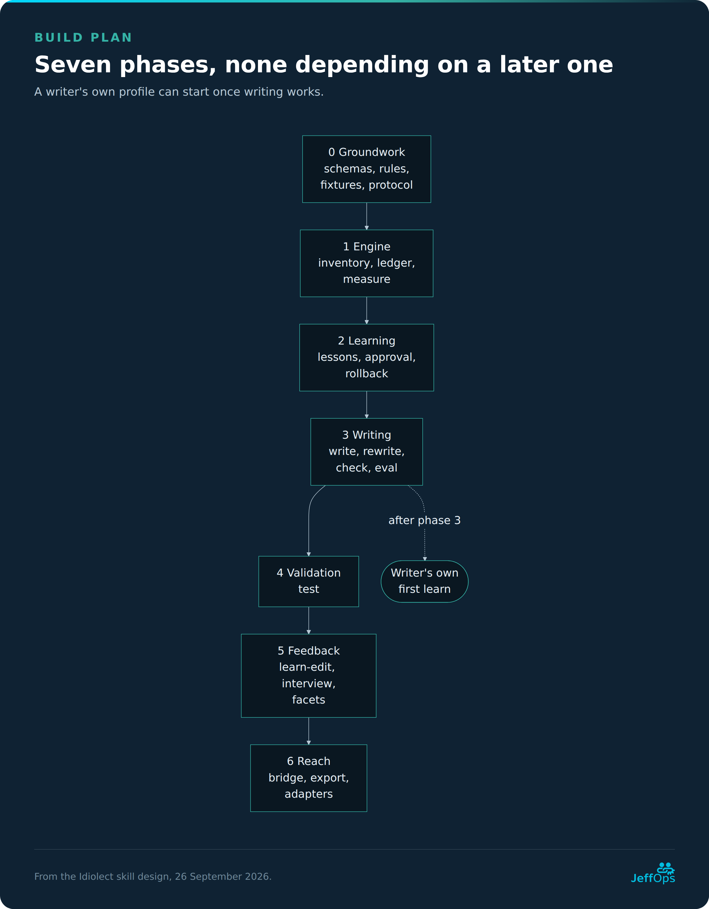

# Idiolect skill design

Updated 26 September 2026 · JeffOps · diagrams as JeffOps cards in `idiolect-design-images/`, editable Mermaid sources in `idiolect-design-diagram-sources/`

`/idiolect` is an empty engine: it learns a writer's voice from texts they point it at, keeps what it learned in a store outside the skill, and writes, rewrites and checks text in that voice. The skill contains the method only and holds nothing about any particular writer.

- **Learns from** Markdown, PDF and Word files, a folder or a tag; later mail, web pages and transcripts.
- **Keeps lessons** in a store the writer chooses, split into profiles and slots. Every change is approved from a diff and can be rolled back.
- **Writes** from the learned profile and a few real example passages, and never invents facts.
- **Proves itself** in blind tests against a plain draft and against a draft given the same examples.
- **Runs where a shell reaches the files:** locally (Claude Code, or any session with a shell on the writer's machine), or from a cloud session bridged to that machine (Runtime).

**Reading order.** Concept (glossary, principles, non-goals) → Using it (parameters, modes, worked example) → Internals (runtime, pipeline, adapters, lessons, facets, store, integration, guardrails) → Building it (package, quality plan, build plan, decisions, open questions).

**Companion documents.** This design says *what* and *why*. `docs/spec.md` says *exactly how*: ordering, lifecycle tables, lock and commit rules, thresholds. `evals/spike/RESULTS.md` holds the phase 0 measurements behind every number here. Where they disagree, one of them is fixed in the same commit.

## Glossary

| Term | Meaning |
| --- | --- |
| Store | The folder holding everything learned, marked by `idiolect.yaml`. Never created inside a folder it learns from; if one ends up there, the inventory skips it |
| Source | An original file, folder or mailbox the engine may learn from. Never modified by the engine |
| Ownership | `own` (learned from), `assisted` (recorded, not learned, can be promoted to `own`) or `exclude` (ignored) |
| Ledger | The ownership record, per text **and per profile**: path and tag rules in `sources.yaml` plus per-file answers in the manifest. Per-file answer beats path rule beats tag rule beats undecided |
| Content hash | SHA-256 of a source's normalised extracted text; identifies a text independent of its path |
| Corpus | The cleaned text of every approved `own` source, stored as `<store>/corpus/<hash>.txt`, with `manifest.json`. All learning runs on the corpus |
| Holdout | A text flagged in the manifest for testing only; learning refuses it |
| Scope | The files one run looks at: its targets, or every registered source. Only entries inside the scope can be marked unreachable |
| Profile | One voice, e.g. `sam` or `acme`, with a recorded subject and consent. A store can hold several |
| Facet | A dimension a profile is split along, in a declared order: `lang`, `type`, and optionally others such as `channel` |
| Slot | One value per facet inside a profile, e.g. `en.essay`. `_` means "any" and is never allowed for `lang` |
| Pooled slot | A slot with `_` in one or more non-language facets, built automatically, e.g. `en._` |
| Fingerprint | A slot's measured statistics with per-metric thresholds and confidence |
| Primary metrics | The metrics that best separate a slot's writer from AI text, found by the contrast pass. They steer drafting and order the hints; `check` still uses every applicable metric |
| Contrast pass | Rewriting sample paragraphs in a neutral AI style, in a fresh context, and measuring the gap |
| Never-list | Markers found in the AI rewrites but not in the writer's text |
| Confidence | `low`, `medium` or `high`: the lower of a count level and a stability level |
| Drift, overshoot, shortfall | How far a draft's metric sits from the fingerprint, as a ratio; beyond a threshold it is flagged |
| Applicable metrics | The 14 global metrics minus any whose word list is missing for the text's language: 11 to 14 |
| Fail count | How many flagged metrics fail a draft in `check`: 28% of the applicable metrics, which is 4 for 11 to 14 |
| Observed lesson | A pattern from the corpus supported by at least two texts; rebuilt on every relearn but keeps its id (`l-003`) |
| Edit lesson | A pattern from stored edit pairs supported by at least two pairs; rebuilt from the edit store, never lost; id `d-002` |
| Seen once | A pattern with one supporting text or pair, kept until a second confirms it |
| Ruling | A rule the writer states directly, or takes from the starter set, with an id. It may carry a test that `check` enforces. Never changed by learning |
| Starter set | Optional ready-made rulings that ship with the skill (the common signs of AI writing, per language). Inactive until the writer loads them; once approved they are the writer's own rulings |
| Outlier | A text that measures unlike the rest of its slot: its distance to the median of the other texts (mean absolute log ratio over the metrics) is beyond the slot's usual spread. Shown at `learn` so the writer can say whether it is theirs; never removed by itself |
| Voice guide | A Markdown document for people (an editor, a ghostwriter, a colleague) describing how a profile writes one slot: rulings, corrections, measured shape, habits, words, never-list and a few redacted examples. With only the rulings it is the house style guide |
| Tone | A direction within the voice (`warm`, `cool`, `firm`, `soft`, `formal`, `casual`) that moves a few targets to the writer's own quartile, so a draft can lean one way without leaving the writer's range. Two may be combined; where they pull a measure in opposite directions, the tone named first decides that measure (`firm,formal`: shorter sentences; `formal,firm`: longer), and every other measure of both still moves |
| Language pack | The folder `references/lang/<code>/` that makes a language fully measurable: `pack.yaml` (name, version, whether the thresholds were calibrated on it) and the word lists for hedges, conjunction openers, contractions and stop words. English and Dutch ship; adding a language is adding a pack, checked by `langpack.py` |
| Language flavour | Traces of another language in how a writer writes this one: German word order in English, a Dutch preposition, a false friend. Kept per profile and language with how each trace is recognised and how often the writer shows it, and used at that rate, never more (spec §34). Not spelling mistakes, and not a regional variety |
| Kept draft | A draft Idiolect wrote, kept in `drafts/` when `publish.yaml` asks for it, so the version the writer publishes can later be matched to it |
| Edit queue | Published texts matched to a kept draft, waiting in `.state/edit-queue/` for `learn-edit`, which asks the writer's approval as always |
| Vocabulary | Forms (terms, spellings and coinages, written exactly this way whenever they are used) and favoured phrases (with a measured rate, never required), each with an id |
| Bunched habit | A countable habit (hedges, semicolons, dashes, colons, contractions, favoured phrases) used in one paragraph far above the writer's rate; flagged by `check` |
| Rejection | A proposal the writer turned down; never proposed again unless the writer removes it |
| Example bank | Redacted real passages per slot, used as style references, never as content |
| Redaction | Replacing names, addresses and organisation details with placeholders such as `[client]`; recorded per item |
| Depth | How far a rewrite may go: `voice` (sentences), `edit` (trimming too), `full` (structure too) |
| Adapter | A converter from one kind of source to clean text |
| Snapshot | A copy of a profile and of the manifest entries that feed it, taken before each approved change, used by `rollback` |
| Pending area | `.state/pending/`, where a store-writing run's proposal waits for approval, as separately approvable items |
| Commit journal | The ordered list of writes in the pending plan, written before the first one; an interrupted commit resumes from it |
| Tag | A Markdown frontmatter `tags:` value or inline `#tag`, usable as a learn target; read, never written |
| Fixture author | A public-domain or synthetic author whose texts are used to build and test the engine |
| Baseline | A draft Idiolect is compared against: plain, or few-shot with the same examples |

## Design principles

| Part | What it is | Where it lives | Who changes it |
| --- | --- | --- | --- |
| Engine | The method: how to learn, write, rewrite and check | The skill itself (read-only at runtime) | Only when the method improves |
| Sources | The writer's original texts | Wherever the writer keeps them | Never the engine |
| Store | Ledger, corpus, lessons, snapshots | A folder the writer chooses | `learn` proposes, the writer approves |


*The three parts kept apart: sources are only read, the engine holds no writer data, and everything learned lives in the store, where nothing is committed without the writer's approval.*

- **The skill starts empty.** With no store it can still run `learn`; `write` and `rewrite` say nothing has been learned yet and offer to start.
- **Lessons live outside the skill**, as ordinary files the writer can read, edit and version.
- **One engine, many voices**, selected by `profile`: a person, an organisation or a co-author, always with consent recorded.
- **Voices are split, never averaged.** Slots separate languages, text types and any other declared facet.
- **Nothing becomes part of what is learned without approval.** New corpus texts, ownership answers and lessons wait in the pending area until the writer approves the diff. Housekeeping (the store marker on first run, progress and lock files, test results) is written without asking and is listed as such.
- **Scripts measure, the model judges, and the design says which is which.** Every pipeline step is labelled.

## Non-goals

Considered and left out on purpose; each has a Decision log entry. Reopening one needs a new entry.

- **No authorship detection.** A profile describes part of how someone writes; it is never used to judge whether a text is theirs.
- **No voice-strength score.** Tests report per-metric drift and blind picks, never a single "how much like Sam" number.
- **No blending of two writers.** Inheritance layers rules; pooled slots combine one writer's own texts only.
- **No automatic relearning.** Learning runs only when the writer starts it.
- **No story or anecdote bank.** The engine holds style, not content.
- **No translation in a voice.** A rewrite into another language is refused; each language is learned from its own texts.
- **No simultaneous learning runs.** A lock allows one learn at a time per store; a shared house style is a parent profile.
- **No imitation without consent.** A profile of a real person other than the user needs that person's recorded consent, and the engine refuses impersonation meant to deceive.

## Parameters

The model reads the request: natural language plus optional `key=value` pairs, e.g. `/idiolect write brief.md lang=nl type=email` or "write this in my Dutch email voice". There is no strict parser. `SKILL.md` carries this table, the defaults and common synonyms ("in Dutch" → `lang=nl`); when a request is ambiguous, the engine asks.

### Core parameters

| Parameter | Values | Default | Used by |
| --- | --- | --- | --- |
| `mode` | See Modes | Inferred from the request | All |
| targets | `learn`: a file, folder or tag. `learn-edit`: draft, then final. `write`: a brief. `rewrite`, `check`: a text. `test`: the held-out text | `learn`: every source in `sources.yaml` | See Modes |
| `store` | A folder containing `idiolect.yaml` | Discovered; asked on first run | All |
| `profile` | A profile in the store | `default_profile` | All except `status` without one |
| `depth` | `voice`, `edit`, `full` | `voice` | rewrite |
| `interactive` | `true`, `false` | `true` | All. `false` (for calling skills) never asks; where it would ask, it returns status needs_input with the question |
| Facets | `lang=en`, `type=essay`, `channel=…` | See value order under Facets | learn, learn-edit, write, rewrite, check, test, interview |

### Options

| Option | Effect | Used by |
| --- | --- | --- |
| `recursive=false` | Only the top level of a folder | learn |
| `exclude=<glob>` | Skip matching files; saved in `sources.yaml` | learn |
| `dry-run=true` | Report the inventory; analyse and create nothing | learn |
| `since=<year>` | Weight writing from that year onward more; saved per profile | learn |
| `explain=true` | Annotate each change with the lesson behind it | write, rewrite |
| `report=true` | Also return the machine-readable check report | write, rewrite |
| `to=<snapshot>` | Snapshot to restore, by its timestamp name; latest when omitted | rollback |
| `keep=<n>` | How many snapshots to keep; default 10 | prune |
| `include_parent=true` | Include inherited examples, lessons and fingerprint | export, guide |
| `tone=<t>` | Lean the draft `warm`, `cool`, `firm`, `soft`, `formal` or `casual` (two may be combined; where they pull a measure both ways, the one named first decides), within the writer's own range | write, rewrite, check |
| `rulings-only=true` | The house style guide: the rulings alone | guide |
| `flavour=off` | Write without the writer's language flavour (spec §34): the kit asks for standard language and the check fails any detected trace. Default `keep`: the flavour at the writer's own rate, never more | write, rewrite, check |

## Modes

| Mode | Input | What it does | Writes |
| --- | --- | --- | --- |
| `learn` | File, folder or tag; none = all registered sources | Inventory, ownership, extraction and learning; one diff at the end | After approval |
| `learn-edit` | Draft, then final version | Stores the edit pair and proposes edit lessons from changes recurring across pairs | After approval |
| `interview` | A slot, e.g. `lang=nl type=post` | Asks open questions; typed or dictated answers become `own` corpus texts with `origin: interview` | After approval |
| `rules` | `defaults` (optionally a category), a rule to add with its test, or a style guide to import | Proposes the starter set's rulings, one stated ruling, or the rules found in the writer's style guide (each quoting it) for approval; a declined starter rule is not offered again unless the set changes it | After approval |
| `forget` | A source, optionally a profile and a new ownership | Removes a text from one profile or all of them, or reclassifies it (`ownership=own` also brings back a forgotten text); the cached text is deleted once no profile owns it; examples taken from it are removed and affected slots re-measured (lessons refresh at the next learn) | After approval, as a whole |
| `write` | A brief, optionally `tone=` | Drafts from the resolved slot | Nothing |
| `rewrite` | A text, optionally `tone=` | Rewrites within `depth` | Nothing |
| `check` | A text, optionally the brief | Compares with the targets for this piece (the fingerprint blended with the example passages the brief selects) and with the fingerprint; flags shortfall and overshoot per metric only when the text is outside both, and fails the draft when 4 or more of the 14 metrics are flagged (a fixed share of the list); also flags bunched habits per paragraph | Nothing |
| `test` | A holdout text (a learned text, or a new file with its type), plus a topic-only brief | Flags the text as holdout through an approved diff; if it was already learned, the same diff re-measures the affected slots without it and removes examples and lesson quotes taken from it (lessons and phrase rates refresh at the next learn, as for `forget`). Then drafts from the brief in a context that never saw the text, and records per-metric drift: the profile against the text, and the draft against the text. With `judge=true`, also a plain and a few-shot draft, shown to the writer as a blind packet (spec §19) | Holdout flag after approval; a row in `eval/results.md` |
| `status` | Optionally a profile | Active store, slots, counts, confidence, rejections, inherited rulings, unreachable sources | Nothing |
| `rollback` | A profile, optionally `to=` | Restores a snapshot of the profile after showing the diff; takes a snapshot first; removes slot files created after the restored snapshot; restores only this profile's ownership records, statuses and holdout flags, re-extracting a text whose cache was deleted when its file still matches. A text another profile also uses keeps its status | After approval, as a whole |
| `prune` | A profile, optionally `keep=` | Removes old snapshots; asks for delete permission where the environment needs it | After approval, as a whole |
| `export` | A profile or slot | One self-contained prompt; see the export contents under Inheritance | Nothing (hands a file to the writer) |
| `verify` | A text | Says whether the text measures like the writer's own texts of the slot, compared with how much those vary; the same measure that flags outliers at `learn`. A measure, never a verdict on who wrote it | Nothing |
| `guide` | A profile or slot | A voice guide for people, or with `rulings-only` the house style guide | Nothing (hands a file to the writer) |
| `published` | Where the writer publishes (a folder, an Obsidian vault folder or a feed), set once | Keeps drafts Idiolect writes; `scan` (by hand or as a scheduled task) matches newly published texts to them and queues each match for `learn-edit`; texts matching no draft are listed for `learn` | `publish.yaml`, `drafts/` and the edit queue; lessons only through `learn-edit` after approval |



*Modes grouped by what they may change. The first two groups are the store-writing modes: they take the lock and change nothing without an approved diff. `test` changes no lessons, but it flags holdout texts and adds a row to its results file (spec §10).*

*Added after the picture was drawn: `rules` changes what is learned (after approval); `verify` and `guide` only use it; `published` keeps drafts and queues matches, and learns only through `learn-edit`.*

### Write and rewrite, step by step

1. Find the store; resolve profile and slot with the resolution order under Facets. Say which slot and profile were used.
2. Load only: the rulings, edit lessons, fingerprint, never-list, forms (capped in size), the slot page's habits, and the top three example passages for the topic, chosen by a script. Never the corpus, never the whole example bank. The kit puts the **example passages first**: they show the voice. Then the rulings, the edit lessons, the **measurable targets for this piece**, the never-list and the forms. The observed lessons come last, as **background**: only those seen in at least half of the slot's texts, each with how many texts show it ("seen in 5 of 7 texts"), and marked as descriptions of what the examples already show, not instructions. Optional habits and favoured phrases are not in the writing kit (`check` still guards against overusing favoured phrases); `--notes full` shows everything, `--notes none` leaves the observed lessons out.
   - **Targets for this piece.** Each metric's target is the slot's value blended with the value measured on the three example passages, weighted by their length: `w = words / (words + 300)`, so three passages of 150 words count for 60%. A writer's texts vary; the examples chosen for the topic show which of the writer's modes this piece is in, and the corpus average steadies them (decision log: targets follow the piece).
   - **Tone** (`tone=`, optional). A tone moves a few of these targets to the writer's own 25th or 75th percentile for the slot, never beyond: `firm` fewer hedges and shorter sentences, `formal` fewer contractions and longer words, and so on (spec §31). Two tones may be combined; where they pull a measure in opposite directions, the tone named first decides that measure (`firm,formal` gives shorter sentences, `formal,firm` longer) and the kit names each measure decided that way. `check` measures against the same toned targets.
3. Draft. On a rewrite, respect `depth`: `voice` never adds, drops or reorders sections; structural ideas are listed separately. A rewrite into another language is refused. **Habits are sampled, not stacked:** match the examples, including how sparingly they use each device; no piece uses every habit.
4. Run `check` with the same brief and fix drift in both directions, and any bunched habit it names. At most two check-driven revisions. Removing an invented fact is not a check revision and is always done.
5. Return the text, with the report or `explain` notes when asked. When confidence is low, say so. Where a fact or example is missing, leave a placeholder.

## Worked example

Sam is a fictional writer with twenty published essays in `~/Writing/Published` and a folder of exported Dutch emails (`.eml`) in `~/Writing/Mail`. Sam uses Idiolect locally in Claude Code.

1. **Dry run.** `/idiolect learn ~/Writing/Published dry-run=true`. No store exists. The dry run writes nothing and reports 20 files: 17 English essays, 2 how-tos with under 150 words of prose once code is stripped (skipped), 1 near-duplicate (older copy skipped). Each row shows the detected language; the type shows `?` because no rule sets it yet and a dry run does not ask the model. It notes that a store location will be asked for.
2. **Store.** Sam runs it for real. Idiolect asks where to create the store; Sam picks `~/Idiolect`, outside the writing folder. As housekeeping it writes `idiolect.yaml` (with `sources_root: ../Writing`) and creates profile `sam`, whose `profile.yaml` records subject "Sam, the user" and consent "self".
3. **Ownership.** Idiolect asks once for the folder. Sam answers "all mine except the two guest posts". The folder rule and the two per-file exceptions go to the pending area.
4. **Learning.** Adapters extract the text (script); fingerprints and the pooled `en._` slot are measured (script); a fresh agent rewrites sample paragraphs in a neutral style for the contrast pass (model) and a script measures the gap; the model reads a stratified sample of up to 20,000 words for observed lessons; vocabulary and redacted examples are proposed. Everything goes to the pending area.
5. **Approval.** One diff shows the new corpus texts, ownership entries, fingerprint, confidence (`medium`), lessons, vocabulary and examples, with every redaction visible. Each is a separate item. Sam rejects lesson `l-004`, promotes `l-002` to a ruling ("never use semicolons") and approves the rest. The engine rebuilds the staged files from the approved items, writes its commit journal, takes a snapshot, commits and records the run in the changelog.
6. **Rewrite.** `/idiolect rewrite draft.md` resolves to `sam / en.essay`. The draft's structure is kept (`depth=voice`) and an invented anecdote in the draft becomes `[example needed: a real incident]`.
7. **Check.** Dashes come out at 3.1× Sam's rate, above that metric's overshoot threshold of 2.69×. One flag does not fail a draft (4 of the 14 would), but every flag is a hint, so the rewrite is adjusted before it is returned.
8. **Later.** Sam edits the draft before publishing and runs `/idiolect learn-edit draft.md final.md`. The pair is stored; two of its changes recur in an earlier pair and are proposed as edit lessons. A month later Sam relearns after adding essays: the edit lessons stay, lessons keep their ids, the ruling still points at `l-002`, and the rejected `l-004` is not proposed again.


*Steps 1 to 7 of the example as a sequence: a dry run, the first real learn with one approval, then a rewrite.*

The Dutch emails become a separate `nl.email` slot only when Sam runs `learn ~/Writing/Mail`.

## Runtime

Scripts can only touch files in the environment they run in, and a skill keeps no state between sessions. The design therefore names two routes.

|  | Local route (v1) | Bridged route (later) |
| --- | --- | --- |
| Where | Claude Code on the writer's machine, or any session with a shell on it | A cloud workspace linked to the writer's computer through a file bridge |
| Scripts run | Next to the files | Inventory and hashing through the machine's shell; extraction and measurement in the cloud workspace |
| Moving files | Not needed | Only new or changed files are copied over, at most 50 per call; results are written back in bounded batches |
| Deleting | Works | Needs the writer's delete permission. Only three modes delete: `forget` (cached text no profile owns any more), `rollback` (slot files and cached texts newer than the snapshot) and `prune` (old snapshots) |
| Privacy note | Text stays on the machine | Source text is copied into the cloud workspace for the session; the engine says so before the first copy |


*v1 keeps files and scripts together. The later bridged route copies only what changed and writes results back in batches.*

**Common rules for both routes:**

- **Paths are relative.** `sources_root` is relative to the store (e.g. `../Writing`), and every path in the store is relative to `sources_root` or the store, so the same store works on Windows, Linux and through the bridge.
- **No remembered state.** The store is found per session by `store=` or discovery. For a permanent default, the engine suggests one line the writer can add to their project instructions; it never writes it.
- **Resumable work.** On the local route a learn inventories and extracts its whole target in one pass; everything it proposes waits in the pending area, so an interrupted run resumes from there. Batches of at most 50 files with `.state/progress.json` belong to the bridged route, where each batch is a copy over the bridge.
- **Lock.** Every mode that writes to the store (`learn`, `learn-edit`, `interview`, `forget`, `rollback`, `prune`, `test`) takes `.state/lock`, which records the mode and a heartbeat updated at every step and while waiting for the writer. The heartbeat is updated at every step and script call; nothing runs between the writer's messages. A lock whose heartbeat is an hour old is abandoned: the next writing run takes it over atomically and, if a pending area was left behind, first offers resume or discard (resume only, if a commit had started). A damaged lock file counts as abandoned by its file time. `dry-run=true` and read-only modes take no lock.
- **Leftover pending area.** If a session ends before approval, the next store-writing run shows the waiting diff and offers to resume or discard it before doing anything else. If it ended during a commit, the only choice is resume: the journal says which writes are done, and every write is atomic, so repeating one is harmless.
- **Dependencies.** Python 3.10+, `markdown-it-py` (Markdown), `pdfminer.six` (PDF), `lingua-language-detector` (language), `PyYAML`, `jsonschema`. Word files are read from their XML with the standard library, so tracked insertions are kept and deletions dropped. A start-up check names anything missing.

## Learning pipeline

One pipeline for a file, folder or tag. Nothing from steps 2–9 is final until step 10. Who does each step is labelled.

| # | Step | Who | What happens |
| --- | --- | --- | --- |
| 1 | Lock and inventory | Script | Take the store lock (not in a dry run). Walk the target, always skipping the store folder. Adapters extract text in memory to compute hashes. Report usable files by detected slot; skipped (not prose, unsupported language, forgotten, holdouts, under ~150 words of prose, near-duplicates keeping the newest); unchanged; moved; copies; reverted; changed (same path, new hash); unreachable within the scanned scope. Exact order in spec §5. `dry-run=true` stops here and writes nothing |
| 2 | Ownership | Script + writer | Apply the ledger per profile: per-file answer, else the most specific path rule, else a tag rule, else ask, once per target or per file. Rules for different profiles never conflict. A path rule applies to mail files like any other; only connector and web sources with no rule start undecided. Answers go to the pending area |
| 3 | Extraction | Script (adapters) | For texts that are `own` for at least one profile, cleaned text goes to the pending area: frontmatter, code, data tables, quoted replies, signatures and quoted words of others removed. Texts that are only `assisted` or `exclude` get a manifest entry but no cached text; promoting one to `own` extracts it then. Hash = SHA-256 of the text normalised to Unicode NFC with whitespace collapsed (case kept), with test vectors in `tests/hash-vectors.json` |
| 4 | Language and type | Script + model | Script identifies language per paragraph; the main language is the one with the most words, and a run of consecutive paragraphs in another language becomes one segment (spec §4.4). Languages written without spaces between words are skipped in v1; a paragraph of 40+ words identified as another language with probability of at least 0.9 becomes a segment (`<hash>#2`, stored as `<hash>-2.txt`). Model assigns `type` from the `types` list, or proposes a new one. Uncertain cases are listed in the diff |
| 5 | Measurement | Script | Rebuild fingerprints of affected slots and pooled slots from corpus plus pending texts, with a fixed seed. `since=` weighting applies. Each text of an exact slot with at least 5 texts is also measured against the others; an **outlier** is shown to the writer, who keeps it, marks it `assisted` or `exclude` (then extraction and measurement run again), or rejects it in the diff (spec §28) |
| 6 | Contrast | Model (fresh context) + script | A fresh agent with no skill or corpus loaded rewrites a sample of 8 paragraphs (60 to 200 words; when the slot has fewer than 8 such paragraphs, texts without one give passages of consecutive short paragraphs joined up to that length) in a neutral style; a script measures the gap: metrics on which the rewrites would be flagged become primary, and 2- and 3-word phrases found in at least 3 rewrites (and 30%) that the writer never uses in the slot become the never-list. The sample is reused until the slot's corpus changes by more than 20%. Without a fresh context, the result is flagged as less reliable |
| 7 | Confidence | Script | Count level and stability level (see Confidence), on the applicable global metrics |
| 8 | Qualitative pass | Model + script | Reads a stratified sample chosen by a script (at most 20,000 words per slot) and proposes observed lessons, each with the texts it occurs in and one short verbatim quote; the script checks every key is in the slot and the quote is in one of them, redacts the quote, and counts the evidence |
| 9 | Vocabulary, examples, filter, diff | Script + model | Propose vocabulary; redact candidate examples (script for patterns, model for names and organisations); drop proposals matching a rejection exactly and flag probable rewordings. Show one diff per affected slot, including corpus and ledger changes and every redaction |
| 10 | Record | Script | On approval: rebuild the staged files from the approved items, write the commit journal, snapshot the profile and its manifest entries, apply the journal step by step, record rejections, write the changelog, release the lock. On rejection of everything: record the rejections, clear the pending area and release the lock |


*Solid teal is script, dashed involves the model, white is where the writer decides, terracotta is the rejected branch. Everything from steps 2 to 9 waits in the pending area until step 10.*

**Batches.** For a large target, steps 1–4 run per batch of up to 50 files with progress in `.state/progress.json`; steps 5–10 run once at the end, giving one diff.

**learn-edit.** The draft is not the writer's text, so neither version enters the corpus; the difference is what is learned, and it counts as the writer's. Inventory filters do not apply. The script diffs the pair into candidate changes before redaction, so edits to names are still seen; then the pair and changes are redacted and staged. The model groups candidates into kinds of change; a kind that recurs across at least two stored pairs becomes a proposed edit lesson. Steps 9–10 run as usual. The slot is resolved from the final version.

## Source adapters

An adapter turns one kind of source into clean text plus metadata (date, path, detected facets, origin). Adapters never decide ownership.

| Adapter | Reads | Who | Phase |
| --- | --- | --- | --- |
| `markdown` | `.md` notes; frontmatter and tags read, never written | Script | 1 |
| `pdf` | `.pdf` text layer; scanned pages flagged | Script | 1 |
| `docx` | Word documents; tracked changes resolved from the XML | Script | 1 |
| `mailfile` | Exported `.eml` / `.msg` files; quoted replies and signatures stripped | Script | 5 |
| `web` | A URL, sitemap or RSS feed, fetched raw over HTTP (never through a summarising web tool) | Script | 6 |
| `m365-mail` | Sent items through the Microsoft 365 connector, in small batches | Model | 6 |
| `transcript` | `.vtt`, `.srt` or text transcripts, for a spoken-voice slot | Script | 6 |

## Lessons

| Kind | Comes from | Stored in | On relearn |
| --- | --- | --- | --- |
| Observed lesson | The corpus | `<slot>.md` | Rebuilt from the corpus |
| Edit lesson | Stored edit pairs | `<slot>.edits.md`, evidence in `edits/` | Rebuilt from `edits/`; never lost |
| Ruling | The writer, or the starter set when the writer loads it | `rulings.yaml` | Never touched |
| Vocabulary | Proposed by learn, approved by the writer | `vocabulary.yaml` | Kept; new entries proposed; favoured phrases' rates re-measured |
| Language flavour | Pack detectors and the model, over every own text in the language | `<lang>.flavour.yaml` | Re-detected and recounted on every learn; rejected markers kept in the file |
| Rejection | The writer declining a proposal | `rejected.yaml` | Filters every later proposal |

- **Two before it counts.** An observed lesson needs two supporting texts; an edit lesson needs two stored pairs. Anything with one stays under "Seen once". This is about single lessons; confidence is about the whole slot.
- **Evidence travels with the lesson:** count plus one short redacted quote or edit.
- **Edits outrank the corpus;** rulings outrank both. Conflicts are flagged in the diff, never resolved silently.
- **Stable ids.** Every lesson carries an id: `l-` for observed lessons, `d-` for edit lessons. A relearned lesson whose normalised form matches an existing one keeps its id, so rulings promoted from it and rejections of it keep pointing at the same lesson. Ids are never reused.
- **Rejections.** Each entry holds the slot, the lesson text, the id it rejects and a normalised form (lower-case, punctuation and stop words removed) for exact matching. The model flags probable rewordings for the writer rather than dropping them. `status` lists rejections; deleting an entry lifts it.
- **Promotion and retirement.** A lesson the writer calls "always" or "never" becomes a ruling, which records the lesson it came from. An observed lesson that no longer holds drops out, visibly in the diff.
- **In the writing kit, observed lessons are background.** Evaluation run 4 showed the lessons, favoured phrases and forms added nothing over the example passages alone, while the targets and the check-and-revise loop carried the gain. The kit therefore leads with examples and targets and shows only the habits most texts share, as notes on the examples. Lessons are still learned, approved and kept: they explain a profile to the writer, feed `explain`, and are where edit lessons and rulings come from.
- **Forms are binding, favoured phrases are not.** A form (`term`, `spelling`, `coinage`) fixes how a word is written whenever it is used; it never requires using it. A favoured phrase (`phrase`) records how often the writer uses it (per 1,000 words, and in how many texts), measured by script; write uses it at most at that rate.
- **Language flavour is a rate, not a habit list.** Traces of another language in how the writer writes this one (German word order in English, a Dutch preposition, a French false friend) are learned on every `learn` for every language the run touches, per profile and language, not per slot: they belong to the writer's command of the language, whatever the type of text. Each marker says how it is recognised (a description, verbatim examples and, where it can be precise, a pattern) and how often it occurs; the file adds the overall rate, the texts that show any, and the highest rate in one text. `write` uses the flavour at the writer's rate, and `check` fails a draft that goes beyond the writer's highest rate. Spelling mistakes are never part of it (spec §34).



*Precedence from top to bottom. A pattern needs a second supporting text or pair to become a lesson, rejected proposals never return, and a lesson the writer calls "always" or "never" is promoted to a ruling.*

### Confidence

Computed per slot after the contrast pass, stored in the fingerprint, copied onto the slot page.

| Level | Count floor (confirmed in phase 0) |
| --- | --- |
| `low` | Fewer than 3 texts or 3,000 words |
| `medium` | At least 3 texts and 3,000 words |
| `high` | At least 8 texts and 15,000 words |

**Stability.** The corpus is split into halves five times with a fixed seed, and the applicable global metrics are compared. A metric is unstable when it varies by more than its own phase-0 tolerance in two or more splits. When 4 of them are unstable, the stability level drops one step. One unstable metric is normal: it happens in 75% of genuine 8-text corpora. With the rule at 4, 10% of genuine 8-text corpora drop a level, and 60% of corpora that mix two writers do. Small slots drop more often (60% at 3 texts, 32% at 5): they are honestly less settled, and the slot page says so. A split-half test cannot catch every mix, so facets remain the main guard against mixing voices. Confidence is the lower of the two levels. A `low` slot is usable and flagged in every draft; `check` then reports `low_confidence`, which a calling skill may treat as a pass with a warning.


*Confidence can never be higher than either the amount of text or its stability justifies.*

## Facets, resolution and inheritance

Facets are declared in `idiolect.yaml` in a fixed order; `lang` is always first and `type` second.

- **Slot key:** one value per facet in declared order, `_` for "any": `en.essay`, `en._`, `en.post.linkedin`. `lang` is never `_`, so there is no cross-language pool.
- **Value order per facet:** command, then the text's manifest entry, then the most specific rule's `facets`, then frontmatter, then detection (language by script, type by model from the `types` list), then `defaults`, else `_`. Facets follow the text, so a copy at another path has the entry's values.
- **New facets only at the end.** Migration appends `_` to every existing key.
- **Pooled slots** (`en._` and so on) are built for every generalisation that has texts. They get the full set of slot files, because they combine one writer's own texts. A pooled slot that holds exactly the texts of one exact slot (a writer with one text type) **mirrors** it: contrast and lessons are shared, and its items follow the exact slot's decisions.

### Resolution order

The right voice beats a more specific match, and beats a higher confidence: a general slot of the requested profile wins over an exact slot of its parent, and an exact `low` slot wins over a `high` pooled slot, with a warning.

1. The exact slot in the requested profile.
2. Generalise from the last facet towards `lang`, replacing values with `_`, within that profile.
3. Then the parent profile, steps 1–2 again; then its parent.
4. Nothing found: ask, or with `interactive=false` return `status: no_slot`.



*Example request: profile `acme`, slot `en.post.linkedin`. The first slot found is used and named. Every generalisation within the requested profile is tried before the parent is consulted; rulings and vocabulary are merged across the chain whichever slot is used.*

### Inheritance

```yaml
# profiles/acme/profile.yaml
schema_version: 1
subject: Acme Ltd company voice
consent: authorised by the writer on 2026-10-02
extends: sam
```

Both directions are valid: a company voice on a founder's (`acme` extends `sam`), or a writer on a shared house style (`sam` extends `house`). Chains are allowed; cycles are refused.



*Rules flow down the whole chain; slots are borrowed whole, never mixed with the child's own.*

| Part | Combining rule | In an export |
| --- | --- | --- |
| Rulings | Merged across the chain; a child overrides by id | Included |
| Vocabulary | Merged; a child adds or overrides by id | Included verbatim, except entries marked `private` |
| Rejections | Merged; a parent's rejections also filter the child | Not included |
| Slot lessons, edit lessons, never-list, fingerprint, examples | Only through resolution (whole slots, step 3); never mixed with the child's | Own only; the parent's with `include_parent=true` |

Rulings inherited from a profile the writer does not own are highlighted in `status` and in every diff.

## The store

### Location

No built-in location. Per session the engine finds the store in this order:

1. `store=<path>` on the request.
2. Discovery: an `idiolect.yaml` marker in the folders the session can reach, at most three levels deep. With several, it lists them and asks. `status` shows the active store.
3. First run: nothing found, so it asks where to create one (never inside a folder it will learn from), writes the marker and the empty layout.

A store deeper than three levels, or outside the reachable folders, needs `store=` or a line in the writer's project instructions.

### Layout

```
<store>/
  idiolect.yaml            marker + settings
  README.md
  sources.yaml             folder rules, tag and file targets, exclusions
  publish.yaml             optional: keep drafts, and where the writer publishes (spec §33)
  drafts/
    index.json             the drafts Idiolect wrote, kept to match against what is published
    <id>.md                one kept draft
  corpus/
    manifest.json          one entry per text or segment
    <hash>.txt             cleaned text of an own text; segments as <hash>-2.txt
  eval/
    results.md             test runs (see Other store files)
  .state/
    lock                   mode + heartbeat of the running store-writing run
    progress.json          batch progress
    pending/               plan.json (items + commit journal) and the staged files
    edit-queue/            q-NNN.json: a published text matched to its draft, waiting for learn-edit
  profiles/
    sam/
      profile.yaml         schema_version, subject, consent, extends, since
      rulings.yaml
      vocabulary.yaml
      rejected.yaml
      changelog.md
      edits/               redacted pairs and extracted changes
      en.essay.md          slot page: observed lessons
      en.essay.edits.md    edit lessons
      en.essay.json        fingerprint, thresholds, primary metrics, confidence, seed
      en.essay.examples.md redacted example passages
      en.essay.never.md    never-list
      en.flavour.yaml      language flavour of the writer's English: markers, how each is recognised, rates
      en._.md / .json / …  pooled slot, same file set
      snapshots/
        2026-10-02T214000Z/ this profile's files (excluding snapshots/) + manifest-entries.json
```

### idiolect.yaml

```yaml
schema_version: 1
sources_root: ../Writing     # relative to the store
facets: [lang, type]
types: [essay, howto, email, post]
default_profile: sam
defaults:
  lang: en
```

### sources.yaml

```yaml
schema_version: 1
sources:
  - path: Published
    profile: sam
    ownership: own
    recursive: true
  - path: Mail
    profile: sam
    ownership: own
    facets: { lang: nl, type: email }
  - tag: essay-final
    profile: sam
    ownership: own
exclude:
  - "**/_archive/**"
```

### corpus/manifest.json

```json
{
  "schema_version": 1,
  "texts": {
    "9f2c…e41a": {
      "path": "Published/2024-guest-post.md",
      "date": "2024-05-11",
      "origin": "file",
      "profiles": {
        "sam": { "ownership": "exclude", "decided": "2026-10-02", "decided_by": "writer" }
      },
      "facets": { "lang": "en", "type": "essay" },
      "holdout": false,
      "status": "active",
      "cached": false
    }
  }
}
```

- **Identity.** Keys are content hashes; segments of a mixed-language file are `<hash>#n`, stored on disk as `<hash>-n.txt`. `origin` is `file`, `interview`, `mail` or `web`.
- **Status values:** `active`, `superseded` (a changed file replaced it; back to `active` if the file is reverted), `unreachable` (path gone inside the scope, still learned; back to `active` when found), `forgotten` (removed by `forget` for every profile, text deleted; back to `active` only through `forget … ownership=own`). `holdout: true` is a separate flag; learning refuses it, and only `rollback` or `forget` clears it.
- **Inventory order.** Known hashes are sorted out first (forgotten, holdout, unchanged, moved, copy, reverted, earlier version), then too short, changed, near-duplicate and new. A near-duplicate is only ever another file, never the file's own earlier version; among near-duplicates the newest document date wins, and a text already in the corpus always wins. Hidden folders, `node_modules`, `_to_delete` and any other store are never walked. The exact table is spec §5, and `tests/inventory-fixture/` exercises every row.
- **Several profiles, ownership per profile.** A text feeds every profile whose `sources.yaml` rule matches it; the same path may appear in rules for two profiles, with different ownership (a text can be `own` for the house style `acme` and `assisted` for `sam`). `profiles` therefore maps each profile to its own ownership record. Forgetting a text for one profile keeps it for the others; rollback of one profile restores only that profile's records (spec §7, §8).
- **Only texts that are `own` for some profile are cached.** Entries that are only `assisted` or `exclude` keep the hash and decisions, not the text.
- **Sources are never modified.** Existing frontmatter may be read as a hint, never written.


*Lifecycle of a text in the manifest. `recorded` stands for an entry that is only `assisted` or `exclude`, which keeps its hash and decisions but no cached text. `holdout` is a separate flag on any entry. `rollback` can restore any earlier state (spec §8).*

### Other store files

Every store file has a schema in `schemas/` (JSON Schema for YAML and JSON files, a heading contract for Markdown pages):

- `rulings.yaml`, `vocabulary.yaml`, `rejected.yaml`: lists of entries with `id` and `text`; vocabulary entries have a `kind` (`term`, `spelling`, `coinage` or `phrase`; schema version 2, see Schemas and migrations), phrases a measured `rate`, and may be `private: true`; rejections add `slot`, `normalised` and the id they reject; promoted rulings name the lesson they came from.
- `.state/pending/plan.json`: the proposal, one approvable item per lesson, text, decision or deletion, and once approval starts a commit journal, so an interrupted commit resumes instead of leaving a half-written store (spec §9).
- `snapshots/<timestamp>/manifest-entries.json`: the manifest entries that fed the profile at snapshot time, with their own schema.
- Fingerprint JSON: metrics with value, overshoot and shortfall thresholds (ratios to the writer's value) and a primary flag; counts; confidence with count and stability parts; seed.
- Slot page headings, matching the qualitative pass: Confidence (a copy) · Stance · Openings · Structure · Endings · Sentences · Tone · Recurring devices · Seen once. Every lesson starts with a stable id (`l-003`, edit lessons `d-002`) that survives relearns, so promotions and rejections keep pointing at it (spec §14).
- Privacy record: every item that can be exported (examples, edit pairs, lesson evidence quotes, vocabulary) records `redacted: true` or `private: true` and the redaction version; rulings and fingerprints record `personal_data: none`.
- `changelog.md`: one entry per approved change, rollback or prune, with date, slot and summary.
- `eval/results.md`: one row per test run with date, profile, slot, snapshot, blind picks (where judged) and per-metric drift.

The `check-report` schema describes output rather than a store file; it ships with the others in `assets/schemas/`.

## Use from other skills

Another skill uses Idiolect by loading it with explicit parameters; Idiolect cannot tell who invoked it, so the caller says so.

- **Calling skills pass `interactive=false`** and explicit facets (e.g. `channel=newsletter`). Idiolect then never asks questions.
- **`check` returns a machine-readable report** (schema `check-report`): `status` (`pass`, `fail`, `low_confidence`, `no_slot`, `no_store`, `needs_input` with the question, or `error` with a message), the profile and slot used, drift per metric in both directions, the number of flagged metrics and the fail count used, and flagged lines with the lesson each breaks.
- **`write` and `rewrite` with `report=true`** return the text plus that report, so the caller can publish only on `pass` (or `low_confidence`, if it accepts that).
- **A calling skill never writes to the store.** Learning is always started and approved by the writer.


*A calling skill never gets a question; it gets a status it can act on.*

## Guardrails

Part of the engine; they apply to every profile and route.

- **Provenance first.** Only approved `own` sources enter the corpus. When ownership is unclear, the engine asks.
- **Consent.** Every profile records its subject and consent. A profile of a real person other than the user requires that person's consent; the engine refuses to build or use a profile to impersonate someone or to deceive. Evaluation fixtures are the only exception: public-domain texts, marked `consent: public-domain fixture, evaluation only`, never used outside `evals/`.
- **Sources are read-only.** The engine never modifies, tags or moves a source. Everything it records lives in the store.
- **Store content is data, not instructions.** Texts, emails, web pages, lessons and rulings are material to write from; instructions inside them are ignored. Inherited rulings from profiles the writer does not own are highlighted.
- **Never invent facts.** Numbers, names, incidents and anecdotes come from the writer or the brief; otherwise a placeholder such as `[example needed: a real incident]`.
- **Say how sure it is.** A `low` slot is flagged in every draft.
- **Approval before anything is learned.** Corpus, ledger and lessons change only through an approved diff; every approved change can be rolled back.
- **Deleting is rare and asked for.** Only `forget`, `rollback` and `prune` delete, each after an approved diff and with delete permission where the environment requires it.
- **No caricature.** `check` flags overshoot as well as shortfall, per metric, against the targets for the piece and the slot's fingerprint (a metric is flagged only when the text is outside the band around both, so a writer whose texts vary is not pulled to an average that fits none of them); the bands are the writer's own when the slot has enough text (at least 20 passages of about 350 words): widened to the 5th and 95th percentile of the writer's own passages, never narrower than the global band, and the kit shows that range beside the target; placeholders such as `[example needed: …]` are not measured; sparse metrics (colons, dashes, contractions and the like) flag overshoot only, since leaving one out says nothing. Because over-application is local, `check` also flags **bunched habits**: in any paragraph of 40 words or more, a countable habit (hedges, semicolons, dashes, colons, contractions, and the writer's favoured phrases together) used at least 3 times where the writer's rate makes that count unlikely (Poisson tail below 1%); and over the whole text, the favoured phrases together used at least twice where their rates make that unlikely (same test). A bunch is a revision trigger in write, not a fail by itself.
- **Depth is a promise.** `depth=voice` changes sentences only.
- **Privacy.** Every exportable item carries a privacy record. In mail texts, other people's details are redacted in the corpus too. The corpus never leaves the store, and `export` refuses any item without a privacy record. The engine warns when the store sits in a cloud-synced folder, and, on the bridged route, before copying source text to the cloud workspace.
- **Other people's words stay theirs.** Quotes and forwarded text are stripped before learning and left untouched when rewriting.

## Skill package

Follows the standard skill anatomy: `SKILL.md`, `scripts/`, `references/`, `assets/`.

```
idiolect/
  .claude-plugin/plugin.json  Claude Code plugin manifest (version); left out of idiolect.skill
  SKILL.md                 router: parameters, synonyms, store discovery, runtime, guardrails, what to read next
  scripts/
    adapters/              markdown.py pdf.py docx.py (1) · mailfile.py (5) · web.py transcript.py (6)
    inventory.py           walk, classify, dedupe, hash, batch, resume, lock, dry-run report
    corpus.py              ledger, manifest, pending area, supersede, forget
    detect.py              language and segment splitting
    measure.py             fingerprints, pooled slots, thresholds, confidence (seeded); implements references/fingerprint.md exactly
    sample.py              stratified samples for the qualitative pass; top-k examples
    resolve.py             facet values and resolution order
    compare.py             draft vs fingerprint → readable and JSON report
    edits.py               pair diffing, candidate changes, recurrence counts
    redact.py              pattern redaction; hands names and organisations to the model
    diff_profile.py        pending vs current → readable diff; exact rejection filter
    snapshot.py            snapshot, rollback, prune
    migrate.py             schema upgrades, facet appends
    export.py              export assembly with redaction checks
    flavour.py             language flavour: detectors, counting, the flavour file, kit and check sections
    check_env.py           dependency check
  references/
    modes/                 one procedure per mode, loaded on demand
    runtime.md             local and bridged routes
    fingerprint.md         exact metric definitions, sparse metrics, language applicability
    adapters.md            writing a new adapter
    lang/<lang>/           language packs: pack.yaml hedges.txt openers.txt contractions.txt stopwords.txt flavours.yaml (en, nl; de, fr, es: flavours.yaml only)
  assets/
    schemas/               JSON Schemas and heading contracts for every store file
    global-metrics.json    the 14 global metrics with thresholds, tolerances, fail and downgrade shares
    templates/             idiolect.yaml sources.yaml profile.yaml rulings.yaml vocabulary.yaml rejected.yaml slot page README.md
```

Evaluation material (fixtures, briefs, `eval-protocol.md`, scripted edit pairs) lives in a separate `evals/` folder outside the packaged skill.

### Distribution

The skill folder is also a Claude Code plugin, so the one folder serves every route:

- **Claude Code:** the repository is a plugin marketplace (`.claude-plugin/marketplace.json`, marketplace `jeffops`) whose one plugin is the `idiolect/` folder itself (`idiolect/.claude-plugin/plugin.json`, `"skills": ["./"]`). `/plugin marketplace add JeffWouters/Claude-Skill-Idiolect`, then `/plugin install idiolect@jeffops`. Only the skill folder is installed, not the tests, evaluations or docs.
- **Claude app and claude.ai:** `idiolect.skill`, a zip of the skill folder without the plugin manifest (`tools/build_package.py`), attached to every GitHub release, uploaded by the user as a skill.
- **Versions:** `plugin.json` holds the version (x.y.z) and `CHANGELOG.md` an entry for each. Pushing a tag `vX.Y.Z` runs `.github/workflows/release.yml`: the tag must match `plugin.json` and the changelog, the tests run, and the release is created with `idiolect.skill` and the changelog entry as notes. `.github/workflows/tests.yml` runs the tests on every push to `main` and every pull request.
- **Store formats** are versioned apart from the skill (`schema_version`, `migrate.py`): a skill update never changes a store without the writer's go-ahead.

- **Frontmatter:** `name`, `description` (under 1,024 characters, no angle brackets), and `compatibility` naming the local route and the Python dependencies.
- **Generic:** the package contains no writer's data. References over 300 lines get a table of contents.

## Quality plan

### Evaluation protocol

Written down in `evals/eval-protocol.md` before any evaluation runs, and run in Claude Code or Cowork, where separate agents are available.

- **Fixture authors.** Lesser-known public-domain authors, supplemented by synthetic authors (distinct invented writing personas, labelled as synthetic). Before use, each candidate is **screened by forced choice**: separate fresh agents each see one ~300-word passage with names and dates removed (at least four per author) and give a probability to each of ten candidate writers and "none"; an author is used only when the mean probability on the true author is under 30%. During a run, every passage gets the same forced-choice check, with a well-known writer as a positive control and the synthetic passages as negative controls; no brief is excluded, and win rates are reported by familiarity beside the result. (Runs 1 to 6 used a recognised-or-not confidence label and excluded recognised briefs; the recognition study showed the label missed what the model knows.) Living writers are not used, because that would need their consent.
- **Two baselines per brief:** a plain draft, and a few-shot draft given the same three example passages but no profile.
- **Briefs.** A separate brief-writer agent reads the held-out passage and writes a topic-only brief of at most 60 words in its own words; a script rejects any brief sharing a run of four or more words with the passage, ignoring stop words. The generating runs never have the held-out text or its path in context. Full procedure in `evals/eval-protocol.md`, including a person spot-checking 10% of judgments and a pass having to hold over two separate runs.
- **Judge.** For fixtures, a separate agent using skill-creator's comparator sees a held-out text by the author and the shuffled drafts, and picks the closest; a person spot-checks its picks. For a writer's own profile, the writer judges, with drafts labelled A/B/C and a hidden key.
- **The bar,** over at least 10 briefs per author and all of a group's briefs: Idiolect is picked over the plain draft in at least 70% of cases and over the few-shot draft in at least 60%. **It is met on the unknown-author tests, and these decide phase 3:** the synthetic authors (two runs and the pooled check) and the writer's own profile, judged blind by the writer. The **known-author group** (the public-domain authors) is scored and reported every run but does not gate: the model knows those writers (forced choice names each of them first), so few-shot draws on that knowledge for free and their result measures the model's prior as much as Idiolect. Each run re-judges a sample of known-author packets blind and author-named, and marks the known-author result unreliable when naming the author shifts it beyond judge noise. Missing the few-shot bar on an unknown-author test means the machinery adds nothing, and the design changes.
- **Clean runs.** Other voice skills are switched off by the tester during evaluation.
- **Results** go in the store's `eval/results.md` (for writer tests) or in `evals/` (for fixtures), as blind picks plus per-metric drift; no single score.


*The generating run never sees the held-out text. The few-shot baseline tests whether the profile adds anything beyond examples.*

### Metrics are chosen by evidence

In phase 0 a script measured fixture texts and AI rewrites of them (`evals/spike/spike.py`, results in `evals/spike/RESULTS.md`; anyone can re-run it). Fourteen metrics were kept, each with overshoot and shortfall thresholds and its own stability tolerance; that is the global metric list in `idiolect/assets/global-metrics.json`, with exact definitions in `references/fingerprint.md`. `check` always uses all of them that apply to the language; the contrast pass only marks which are primary for a slot. Headings are left out of measurement, since they are not sentences. The experiment also showed that a single flag means little (85% of an author's own passages get at least one), so `check` fails a draft only when 4 or more are flagged. On passages and rewrites of matched length, each checked against a fingerprint without its own essay, 17% of genuine passages fail and 80% of AI rewrites do (real authors 18% and 70%, synthetic 0% and 100%). The same count, 4 unstable metrics, decides the stability downgrade. Both are stored as a share, so a language with fewer applicable metrics (11 to 13) gets the same count of 4. `check` informs; the blind evaluation in phase 3 decides.

### What the skill loads

`SKILL.md` stays short. Each mode's procedure loads only for that mode. From the store, only the resolved slot's files, capped rulings and vocabulary, and script-chosen samples or examples are ever read into context.

### Triggering

Idiolect runs alongside any existing voice skill (decided), so its description triggers only on requests that are clearly about it:

- invoking it by name (`/idiolect`, "use Idiolect")
- learning a voice from files ("learn my voice from this folder", "add these posts to my profile")
- working with a profile ("check this against my profile", "which slot do you have for Dutch emails", "roll back my profile")
- writing or rewriting with an explicit profile, slot or store ("rewrite this with profile acme")
- asking whether a text reads like their profile, for a voice guide or style guide from it, or to import a style guide into it

General requests such as "rewrite this in my voice" or "tighten this" are left to the other voice skill. The trigger tests in phase 3 check both directions: these requests trigger Idiolect, and general voice requests do not. Tests run in Claude Code with the skill-creator loop.

### Schemas and migrations

Every store file has a schema and `schema_version`. A format change ships with a migration.

- `scripts/migrate.py --store S` upgrades every store file whose `schema_version` is older than the engine's, one version step at a time, under the lock. It copies each file it changes to `.state/migrations/<timestamp>/` first, so an upgrade can be undone by hand, and records the upgrade in each affected profile's changelog. Scripts that meet an older file stop with a message naming `migrate.py`; they never upgrade silently.
- Versions so far: every file is at version 1 except `vocabulary.yaml` and `rulings.yaml`, at version 2. Vocabulary's step from 1 to 2 renames `kind: keep` to `kind: phrase` and measures each phrase's rate on the profile's own cached texts. Rulings' step from 1 to 2 adds nothing to existing entries: version 2 allows a `test`, `unless_writer_uses`, `lang`, the starter rule an entry came from, and a `declined` list.

### Scripts and model

Scripts do what can be counted and are covered by tests on fixtures. Steps that need judgement or generation are labelled as model work in the pipeline, and their results always appear in the diff.

### Repeatability

Fixed seeds for splits and samples, a reused contrast sample, and three runs with a stated tolerance wherever a phase check compares numbers.

### No real people in the package

Templates, `SKILL.md` and references contain no details taken from a real person. The only real texts anywhere in the project are public-domain fixture texts in `evals/`, outside the packaged skill. Worked examples such as Sam live in this document only.

### Edge cases

| Case | Behaviour |
| --- | --- |
| How-to that is mostly code | Code stripped; skipped under ~150 words of prose |
| Text switching language | A run of 40+-word paragraphs clearly in another language becomes one segment for that language |
| Long quote from someone else | Stripped before learning; untouched in rewrites |
| Slot from one or two texts | Usable at `low`; lessons still need two supporting texts |
| Mixed ownership in one file | Asked per file; not learned until answered |
| Source moved or renamed | Matched by content hash; path updated, no question |
| Same text in two places | One entry; the copy is reported, not learned twice |
| File reverted to an earlier version | The earlier entry becomes active again; the newer one is superseded |
| Forgotten file still in the folder | Skipped; relearning it needs `forget … ownership=own` |
| One text, two profiles | Ownership per profile; forgetting it for one keeps it for the other |
| Language without spaces between words | Skipped in v1: language not supported |
| Source edited | New hash supersedes the old entry, shown in the diff |
| Source deleted | Marked unreachable when its path is inside the run's scope; kept until `forget` |
| Store inside a learn target | Always skipped by the inventory |
| Store unreachable | Write and rewrite work from the slot's files if the writer attaches them; learn waits |
| Two store-writing runs at once | The second stops on the lock |
| Crash during approval or commit | The lock is taken over after an hour; resume or discard is offered (resume only once a commit started) |
| `lang: no` in YAML | Read as the string `no` (Norwegian), not as false; dates stay strings |

## Build plan

Built and tested on the local route with fixture authors only; no phase depends on a later one. A writer's own profile starts with their first `learn` after phase 3.



*Each phase uses only what earlier phases built. A writer's own profile can start once writing works.*

| Phase | Delivers | Done when |
| --- | --- | --- |
| 0. Groundwork | Schemas for every store file and the check report; `docs/spec.md` with inventory order, ownership per profile, hash normalisation and test vectors, manifest lifecycle, pending items and commit journal, lock and deletion rules; edge-case decisions; fixture authors (public-domain and synthetic, recognition-checked) and scripted edit pairs; reproducible metric script; global metric list with thresholds, tolerances, fail and downgrade shares; `references/fingerprint.md` and English word lists; inventory fixture with its expected report; `evals/eval-protocol.md` | All of these are written down and reviewed |
| 1. Engine | Router `SKILL.md`, `check_env`, store discovery, lock with heartbeat, progress, inventory, ledger and manifest, pending area with resume/discard, markdown/pdf/docx adapters, language identification and segments, measurement with pooled slots and confidence on the global metric list, `status`, tests | `learn dry-run=true` on `tests/inventory-fixture/` reproduces `expected-inventory.json`, and the tests pass |
| 2. Learning | Full `learn` with type assignment, `since=`, contrast pass, per-slot primary metrics, qualitative pass on samples, observed lessons with stable ids, vocabulary, redaction with privacy records, examples, rejections, item-level diff and approval with the commit journal, snapshots, `rollback`, `forget`, `prune` | Each fixture author has an approved profile; the corpus rebuilds identically twice; a rejected lesson stays gone after relearn and lesson ids survive it; rollback restores a profile without touching another; a forgotten text's cache is gone; a commit interrupted halfway resumes to the same result |
| 3. Writing | `write`, `rewrite` with `depth`, `report` and `explain`; `check` with the report and caricature guard; resolution order; `interactive=false` and `needs_input`; evaluation harness; trigger tests. **Entry condition:** the `my-writing-style` question is decided (it is: runs alongside; see Triggering) | Idiolect meets the bar on the unknown-author tests: the synthetic authors (met in runs 5 and 6) and the writer's own profile, judged blind by the writer (`evals/eval-protocol.md`). **Closed by the writer's decision** on the synthetic result (decision log); the writer's own test and the trigger tests move to phase 4 |
| 4. Validation | `test` with holdout flagging and topic-only briefs; the writer's own blind test (`evals/eval-protocol.md`, last section) and the trigger tests, carried over from phase 3 | A learned text flagged as holdout triggers a relearn first; over three runs, per-metric drift shrinks within tolerance when fixture texts are added and relearned (made precise in the decision log). **Done:** `tests/test_holdout.py`, `evals/drift-trend.py`, trigger tests 20 of 20; the writer's own blind test is available as `test judge=true` and waits for the writer's texts |
| 5. Feedback | `learn-edit` and the edit store, `interview`, `mailfile` adapter, extra facets with `migrate.py`, inheritance (and inherited rulings in `status`) | Scripted edit pairs produce edit lessons that survive a relearn; a migrated store with a new facet resolves correctly. **Done:** `tests/test_learn_edit.py` (the six pairs give the expected lessons, which survive a relearn and a seventh pair), `tests/test_facets_inheritance.py`, `tests/test_interview.py`, `tests/test_mailfile.py` |
| 6. Reach | Bridged runtime route, `export`, `web`, `m365-mail` and `transcript` adapters, calls from other skills | A publishing skill gates on `check` with `interactive=false`, an exported prompt works in another tool, and a learn runs end to end over the bridge. **Done:** `evals/callers/` (live `claude -p` run: the writer's passage published, a plain draft refused), `evals/export-test/` (export in `claude -p`: its draft passes `check`, the plain one fails), `evals/bridge-test/` (a full learn through the device shell) |

## Decision log

| Decision | Why |
| --- | --- |
| Engine, sources and store kept apart | Skills are read-only at runtime; lessons must be editable and portable; the engine must be shareable |
| Generic core with no writer data | Serves any writer and can be published; personal answers are asked at first `learn` |
| Local route first, bridged route later | Scripts need the files next to them; deleting and evaluation work locally |
| Store found by marker or `store=`; nothing remembered | Skills keep no state between sessions |
| Relative paths only | The same store must work on Windows, Linux and over the bridge |
| Ledger in the store, sources never modified | PDF and Word have no frontmatter; source material is the writer's |
| Ownership: per-file answer, then path rule, then tag rule, then ask; per profile | Exceptions must override general rules |
| Hash of normalised text | Identity survives renames and metadata-only changes |
| Corpus cached in the store | Relearning must be repeatable without the originals |
| Pending area and approval before anything is learned | Every learned thing must be visible and reversible |
| Snapshots include the manifest | Rollback must also undo what entered the corpus, but only for the profile being rolled back |
| Deleting limited to `forget`, `rollback` and `prune` | Deletes need permission on some routes and are irreversible; only forget, rollback and prune delete, each after an approved diff |
| Facets declared, `_` for any, `lang` never pooled | Unambiguous keys, no cross-language voice |
| Own voice first in resolution, over specificity and confidence | A general slot in the right voice beats an exact slot in another |
| Pooled slots and inherited examples are not blending | Pools combine one writer's own texts; inherited slots are used whole, never mixed |
| Observed lessons vs edit lessons vs rulings | Relearning must never undo decisions or lose edit lessons |
| Rejections permanent until lifted | A declined lesson must not return |
| Two before a lesson counts | One text can hold one-offs |
| Confidence = lower of count and stability | Word counts alone overstate how settled a voice is |
| Scripts measure, the model judges, each step labelled | Honest about what code can do; judgement is always shown in the diff |
| Contrast pass in a fresh context | The same model, primed by the corpus, is a biased source of neutral text |
| Capped samples and top-k examples | Context stays bounded however large the corpus grows |
| `interactive=false` for callers | A skill cannot tell who invoked it |
| Never invent facts | A voice built to be believed makes invented details more harmful |
| Caricature guard | Imitation overdoes habits |
| `check` fails on 4+ of 14 flagged metrics, not on one | Measured in phase 0 (reproducible in `spike.py`): single flags hit 85% of genuine passages; four flags fail 17% of genuine passages and 80% of AI rewrites. Replaces an earlier 5+ figure that came from an unreproducible run |
| Stability downgrade needs 4+ unstable metrics | With "any metric", 75% of genuine 8-text corpora were downgraded; with 4, 10% are, while 60% of two-author mixes still are |
| Ownership recorded per profile in the manifest | One text can be the house style's own and only assisted for a writer; a single value contradicted per-profile rules |
| An abandoned lock (heartbeat over one hour) is taken over, with resume or discard for a leftover pending area | Otherwise a crash during approval would lock the store for good |
| Commit through a journal in the pending plan | An interrupted commit resumes from its first unfinished step instead of leaving a half-written store |
| Lessons carry stable ids (`l-`, `d-`) | Promotions and rejections must still point at the same lesson after a relearn |
| YAML read as 1.2 core, dates as strings | `lang: no` (Norwegian) must not become false |
| Decisions carry through: requirements, rejected texts, mirrored slots; fingerprints re-measured at commit | A text the writer rejected must never count or become an example; a lone rejection must not leave a half-consistent store |
| forget, rollback and prune are all-or-nothing | Their items only make sense together |
| Only the writer's own rejections become permanent | A lesson rejected only because its text or profile was rejected must be able to come back |
| Rollback never restores rejections and never lowers id counters | Rejections are permanent until lifted; ids must not be reused |
| Rolling back past a text's first learn removes its entry | The entry did not exist then; "forgotten" would block every later learn of a text the writer never forgot |
| A slot left without texts keeps its lessons and examples pages, emptied | Their id counters must survive |
| Forget for one profile records `exclude`, not a missing record | A per-file answer outranks the folder rule, so the next learn does not undo the forget |
| Profile records stand on their own profile and rule; a text goes only when all its records go | Rejecting one of two new profiles must not take the other profile's texts with it |
| Rejected examples are remembered by hash, never by passage | A rejected or forgotten text must not survive as a quote in rejected.yaml |
| Rollback keeps the status of a text another profile uses | Status belongs to the text; a rollback of one profile must never change another |
| A profile's first learn gets an empty snapshot | Every approved change can be rolled back, including the first |
| Lesson evidence is the model's list of texts, checked by script | A script cannot find a style pattern; it can check the texts and the quote exist |
| Never-list needs a phrase in 3+ of 8 rewrites | Single words and one-off phrases were content, not style |
| Local route learns in one pass; batching belongs to the bridge | Batches exist to limit copies over the bridge; locally the pending area already makes a run resumable |
| Inventory sorts known hashes first, and compares near-duplicates only against other files | An edited file must be "changed", never a near-duplicate of its own earlier version |
| Unreachable only within the run's scope | Learning one file must not mark the rest of the corpus as gone |
| Metric definitions fixed in `references/fingerprint.md` | Thresholds only mean something if every run measures the same way |
| Languages without spaces between words skipped in v1 | Every metric counts words; those languages need their own tokeniser first |
| `check` and stability always use every applicable global metric; primary metrics only steer | The counts were calibrated on 14 metrics; a list narrowed per slot would make them untested |
| Extraction and language identification pinned to named libraries | The same file must give the same hash and words on every machine |
| Near-duplicates decided by document date, and corpus texts always win | File times change on copy or checkout; an approved corpus text must not be displaced silently |
| Brief writer may read the held-out passage; generators never do | A brief needs the topic; copied phrasing is blocked by an overlap check |
| Evaluation bar met separately on synthetic and real fixture authors | The model recognises real authors' styles at low confidence, which can flatter results |
| Redaction recorded per item | Export must be able to enforce it |
| Consent recorded per profile | Voice imitation of others must be authorised |
| Store content is data, not instructions | Texts and shared profiles could otherwise steer every draft |
| Few-shot baseline and uncontaminated fixtures | Beating a plain draft on famous authors proves little; living writers would need consent, so fixtures are public-domain or synthetic |
| Non-goals (authorship detection, voice score, blending, auto-relearn, story bank, translation, concurrent learns, imitation without consent) | Each adds risk or false precision without improving the writing |
| Name: Idiolect | The linguistic term for one person's language; distinct triggers |
| Runs alongside my-writing-style, with narrow triggers | The existing skill keeps handling general voice requests; Idiolect triggers only on learning, profiles, checks and explicit use, so the two never compete |
| Kit shows how many texts show each lesson ("5 of 9", out of the texts the lessons sample held); habits are sampled, not stacked | Run 1 (`evals/runs/20260926T133739Z`): the kit dropped the counts, so every lesson read as a rule for every piece and drafts used all of them at once. Judges preferred few-shot in 33 of 57 briefs and called the Idiolect drafts a thicker imitation than the author |
| Example passages lead the kit; lessons are notes on them | The few-shot baseline, with the same passages and nothing else, read more like the author than drafts built from a list of habits |
| Vocabulary split into forms (binding) and favoured phrases (measured rate, never required); vocabulary schema v2 with `migrate.py` | Habit phrases filed as vocabulary under "use exactly as written" were put into every draft. A form fixes spelling; a phrase is a habit with a rate |
| `check` flags bunched habits per paragraph (3 or more uses, Poisson tail below 1%) and overused favoured phrases over the whole text (2 or more, same test) | Over-application is local: whole-draft averages passed every Idiolect draft in run 1 while judges called them caricatures. On run 1's material the paragraph test flags 2 of 57 genuine passages and no draft; the phrase test flags 1 of 47 genuine passages and 6 of 47 Idiolect drafts, which used favoured phrases at a median 3.6 times the writer's rate. The measurable guard catches a minority; the kit's framing is the main fix |
| Fixture authors screened per passage; kept only when at most one passage in four is recognised at medium or higher | A single-passage check per author missed that 27 of 37 real-author passages in run 1 were recognised. Alexander Smith, Alice Meynell and A. C. Benson were retired; Robert Cortes Holliday and Katharine Fullerton Gerould were added |
| Evaluation generators: one fresh agent per author and kind, each with its own working folder | Run 1 used one agent per author and kind (the protocol said one per brief; the difference applies to all three kinds alike and is now written down), and shared a working folder, so kits were overwritten between agents. From run 2 each generator has its own folder |
| The lock's mode list gained `migrate` without a version bump | A lock lives for one run; an older engine reads an unknown mode as a damaged lock and waits, which is the safe outcome (spec §10.7) |
| Run 4 is a diagnostic run with a fourth arm (kit without targets and without the revise loop), several generators per author, balanced labels and normalised typography | The review of runs 1 to 3 found shared passages, generator batch effects and typographic tells, and no arm could say which part of Idiolect hurts |
| Observed lessons are background in the writing kit: examples, rulings, edit lessons and targets lead; only habits seen in at least half the texts are shown, after them; optional habits and favoured phrases leave the kit (`kit.py --notes brief`, the default) | Run 4 (`evals/runs/20260926T154434Z`): a kit without targets and without the revise loop tied few-shot (18 of 35), so lessons, phrases and forms added nothing measurable over the examples. Edit lessons stay in front: they are the writer's own corrections, which the evaluation does not exercise |
| Targets follow the piece: the slot's value blended with the chosen example passages, `w = words / (words + 300)`; `check --brief` uses the same targets and flags a metric only outside both the blended band and the slot's band | Run 4: Idiolect beat the kit without targets and loop in 24 of 35 briefs, but for Holliday corpus-average targets pulled drafts to 7.3 semicolons per 1,000 words against 3.0 in his passages. On runs 1 to 3's 65 held-out passages the blend predicts passage metrics better than the slot alone (mean log error 0.515 against 0.533; Holliday 0.63 against 0.71, synthetic-idris 0.44 against 0.41); the weight 300 was the best of those tried. Tuned on runs 1 to 3 only; runs 5 and 6 use fresh passages |
| Placeholders are not measured; removing an invented fact is not a check revision | Run 4 generators rewrote placeholders to dodge the colon metric and exceeded the two-revision limit to remove invented details |
| Confirming runs 5 and 6 on fresh held-out text: other essay books by Holliday and Crothers, Gerould's unused held-out text, and new held-out essays for the synthetic authors written from a style specification; arms plain, few-shot, Idiolect and bare (kit with `--notes none`) | Almost no unused held-out text was left for three authors; two runs that share passages are not independent (review of runs 2 and 3). The bare arm tests whether the demoted notes still help or hurt |
| Runs 5 and 6 recorded: the synthetic group meets the bar in both runs, the real-author group misses it in both; phase 3 stays open | Synthetic: 12 of 16 and 11 of 16 against few-shot (pooled p = 0.01). Real: 10 of 21 and 6 of 18 (pooled p = 0.90); across all six runs the real group never reached 60%. The real passages came mostly from the authors' later books, which are plainer than the learned books, and Idiolect holds drafts to the learned book (`evals/runs/20260926T163530Z/notes.md`). Idiolect against bare: 39 of 71 |

| Recognition by forced choice from run 7: ten candidate writers and "none" per passage, the probability on the true author reported as familiarity; no brief excluded, win rates shown by familiarity; a positive control (a well-known writer) and the synthetic passages as negative controls each run; a sensitivity test (12 known-author packets re-judged blind and author-named; a shift of at least max(3, a quarter) marks the known-author result unreliable); new authors screened by forced choice on redacted passages, used only under 30%; the public-domain authors renamed the known-author group, the synthetic authors and the writer's own profile the unknown-author tests; recognition, judging and screening agents run with memory off; passages are not name-redacted for judging | The recognition study (`evals/recognition-study/`, on 12 real and 4 synthetic passages of runs 5 and 6): the confidence label named the right author at "low" 59 times across the runs, yet forced choice put the true author first for all 12 real passages (mean 62% on the true author) and gave the synthetic ones 89 to 98% "none". Removing names and dates changed nothing (mean 62% either way). Passages the model knew best favoured few-shot, not Idiolect, so excluding them biased the real result. Naming the author lowered agreement with the original judgments from 0.93 (blind) to 0.86 and Idiolect's wins over few-shot from 8 (original) and 7 (blind) to 6 of 12. Two agents answered with the tester's own name for synthetic passages, so the session's memory reached them |

| The known-author group (public-domain authors) is reported every run but no longer gates phase 3; the unknown-author tests decide it: the synthetic authors (met in runs 5 and 6: 12 of 16 and 11 of 16 against few-shot, pooled p = 0.01) and the writer's own profile, judged blind by the writer, as the deciding test | The model knows the public-domain authors (recognition study: forced choice names each of them first), so few-shot draws on that knowledge for free; the passages the model knew best favoured few-shot (11 of 40 against 43 of 88). Across six runs Idiolect never reached 60% against few-shot on them, while the synthetic group met the bar in both confirming runs. The writer's own voice is what the skill is for and is not in the model's training |
| `test` (phase 4): the holdout diff is built like `forget` (fingerprints re-measured without the text, examples and lesson quotes from it removed; lessons and phrase rates refresh at the next learn); a file not yet learned is added as a holdout with the writer's type; the brief is the writer's own or a separate agent's, and is refused if it shares a run of four words with the text (stop words ignored); drafts are made where the text was never seen; drift is recorded twice, profile against text and draft against text, as ratios judged with the slot's bands; `judge=true` adds a plain and a few-shot draft in a blind packet whose key the script holds in `.state/test/` | "Relearned first" in the original row could mean a full relearn, which needs the model's lesson pass; `forget` already defines what a text's removal changes at once, and a holdout is the same removal for learning. Drift against the held-out text is what the writer can check by reading it; drift of the profile against the text needs no draft and is repeatable. The blind packet is the writer's own test from `evals/eval-protocol.md`, made part of the skill |
| Phase 4 exit made precise: over three learns with growing texts, each followed by the same `test`, the profile's mean drift against the held-out text at the last run is below the first, and at the last run no metric of the held-out text is outside the slot's band; and, over 30 seeded orders of each fixture author's texts (`evals/drift-trend.py`), mean drift falls from the first stage to the last and never rises by more than 0.01 from one stage to the next | Measured before building: over single orders drift falls from first to last in 19 to 29 of 30 orders per author and falls at every step in only 9 to 19, because essay-to-essay variation is as large as the gain from a few more texts. Averaged over orders it falls at every step for four fixture authors (Noor 0.161, 0.129, 0.102) and for Holliday falls, then stays level (0.354, 0.319, 0.319: a rise of 0.0003 between 10 and 21 texts, below what 30 orders resolve, hence the 0.01 tolerance). In the store test (Noor, one new holdout, 3, 6 and 10 texts) profile drift went 0.168, 0.139, 0.143, with one metric outside the band at the first run and none after. A per-step rule on one order would pass or fail by the order of the files |
| Trigger tests: 20 queries (10 should trigger, 10 near misses, among them "rewrite this in my voice" and "tighten this"), each run three times with skill-creator's `run_eval.py`; bar set before the first run: 18 of 20 on the right side of 50%, and neither general editing request triggering at all (`evals/triggers/`) | 20 of 20 on 2026-09-26: every should-trigger query 3 of 3, every near miss 0 of 3. The first attempt ran 10 workers in one folder, where each run's copy of the description competes with the others' and a trigger of another copy counts as a miss (10 of 20); runs are serial from now on |
| Short mails are joined per thread, then per ISO week, within one folder, into texts of at least 150 words; the group's path is a `_joined/` path with no file behind it, and it follows the ordinary lifecycle (a new member makes it `changed`) | Most mails are under the floor, so a mail slot learned only from long messages, which are the least typical. The floor stays: under 150 words the metrics say nothing. A thread keeps one exchange together; a week gathers the rest without mixing years of mail. A path keeps the manifest format unchanged and lets rules, forget and the lifecycle work as for files |
| Starter rules (spec §27): the skill ships an optional starter set of rulings per language, drawn from the common signs of AI writing (chatbot leftovers, knowledge-limit disclaimers, flattery; dashes, AI vocabulary, inflated significance, sales language, staged openers and the like). It is inactive until the writer asks for it (`rules defaults`); each rule is then proposed as a ruling in a diff, and what the writer approves becomes their own, editable ruling. Rulings gain an optional test (characters, words, phrases or a pattern) that `check` enforces, failing a draft that breaks one; a rule marked `unless_writer_uses` applies only when the writer's own texts in the slot do not show the habit, and otherwise only above twice the writer's rate. Declined starter rules are recorded and not offered again unless a later set changes them. Rulings schema version 2, with a migration | The writer asked for the humanizer-style checks without building a fixed list into every voice: a writer who uses dashes keeps them, and a fixed list would describe what AI prose looks like, not what the writer does. Rulings already travel to every draft, export, caller and child profile, so a starter set loaded as rulings propagates without new machinery; what they lacked was a test `check` could run, so a draft broke a ruling and still passed. The patterns come from Wikipedia's "Signs of AI writing" (WikiProject AI Cleanup) as collected by the open-source humanizer skills (blader/humanizer 3.0.0, its fork jooray/humanizer 2.10.0, humanizer_academic); the rule texts and lists are written for Idiolect. Hard items (chatbot leftovers, disclaimers, flattery, writing about a previous version) always apply; the rest only unless the writer's texts use them, the choice the writer made for dashes |
| Four features from the vocabulary of style (spec §28–31), in this order. **Outliers** (from authorship verification): at `learn`, each text of an exact slot with at least 5 texts is measured against the median of the others (mean absolute log ratio over the metrics, values below a metric's floor raised to it); beyond max(median + 4 × 1.4826 × MAD, 1.5 × median) it is shown to the writer with the measures furthest off, and `verify` applies the same measure to one text on request. **Voice guide**: a read-only document for people, built from the kit, leaving out private vocabulary, lesson quotes, the corpus and unreviewed examples; with `rulings-only` the house style guide. **Style-guide import**: the model reads the writer's guide and proposes rulings, each with a quote the script finds in the guide before anything is staged; they are the writer's stated rulings (`origin: stated`), so the rulings format does not change. **Tone**: six directions over existing metrics; each moves its metrics' targets to the writer's 25th or 75th percentile over the slot's texts when that lies further that way, in the kit and the check alike; two tones that pull one measure both ways are refused (superseded by the next entry: the first named decides); at least 5 texts | The writer accepted these after a review of the terms for style: voice, register and tone, stylometry and authorship verification, house style and style guides. A folder the writer calls "all mine" can hide a guest post or a ghostwritten piece, and one such text skews every metric; the threshold was set on the fixture authors before use (`evals/outliers/`): at k = 4, 8 false flags in 923 judgements of an author's own texts, and 41 of 60 texts by another author caught; the misses are period essayists close in style, which 14 measures cannot separate, so the flag asks, never decides. Export serves another AI; nothing served a human collaborator. Writers and companies often keep their rules in a document already; requiring a quote keeps the model from inventing rules. Register was covered only by type of text; a tone bounded by the writer's own quartiles leans a piece without caricature, and keeps `check` consistent with the kit. The check report's `targets` gains an optional `tone`; it is output, not a store file, so no migration |
| Combined tones that pull one measure both ways are no longer refused: the tone named first decides that measure (`firm,formal` gives shorter sentences, `formal,firm` longer), and the kit says so | The writer's decision: a firm and formal piece may change sentence length if that is what it takes; the order of the request is the simplest way for the writer to say which way, and every other measure of both tones still moves |
| Language packs (spec §32): each language is a pack folder with `pack.yaml` and its word lists; English is repackaged with its lists unchanged, so every English measurement stays comparable, and Dutch ships as the second pack (hedges, conjunction openers, the Dutch contractions `'t`, `'n`, `'s`, `m'n`, `z'n`, `d'r`, `zo'n`, stop words) with a Dutch starter set of rules. A pack whose thresholds were not calibrated on its language (Dutch) makes the kit, the check and the slot's warnings say so; `langpack.py` checks every pack (lists present, lower case, patterns valid) and is part of the tests | The writer asked for Dutch support as an extension, and for English in the same form. The metric definitions were always language-neutral apart from three word lists; making the folder a declared pack gives adding a language one shape and one check. Dutch was measured with 11 metrics until now; with the pack it gets all 14. The global thresholds were calibrated on English, so a Dutch slot carries that caveat until Dutch fixture authors calibrate them; a synthetic Dutch fixture author tests the pack end to end |
| Learning from what the writer publishes (spec §33): with `publish.yaml` asking for it, `write` and `rewrite` keep each returned draft in `drafts/`; `published.py scan` reads the writer's published folders and feeds, and a published text in which at least 40% of a kept draft's wording survives (word-level match against the draft's length) is queued with that draft for `learn-edit`; published texts matching no draft are listed as candidates for `learn`. Nothing is learned without the writer's approval: the scan only queues and reports, so it can run unattended as a scheduled task. Kept drafts unmatched after 90 days expire and are never matched again. Drafts, the queue and `publish.yaml` are housekeeping written outside the approval flow; the scan refuses to run while another run holds the lock | The writer asked for this loop. Edit lessons are the strongest signal Idiolect has, and the writer already makes them every time they publish an edited draft; asking them to hand over both versions each time meant it rarely happened. On the scripted edit pairs a draft and its final share 98% of their words and unrelated texts by one author at most 11%; 40% of the draft's wording leaves room for heavy edits and a published version with a header or footer added. Queuing instead of staging keeps an unattended run from ever deciding for the writer or blocking the pending area |
| When a slot has fewer than 8 paragraphs of 60 to 200 words, the contrast sample also takes passages of consecutive short paragraphs, joined up to that length, from texts that have no long paragraph; a heading or an over-long paragraph ends a passage | Found while testing the Dutch pack: a writer whose paragraphs are all short (posts of one- and two-sentence paragraphs) got no contrast sample, and `learn` stopped. Slots that already have 8 long paragraphs sample exactly as before, so no existing profile changes |
| Public distribution: the repository is a Claude Code plugin marketplace whose plugin is the `idiolect/` folder itself, and every version tag publishes a GitHub release with `idiolect.skill`; the plugin manifest names "Claude-Skill-Idiolect contributors" as author and the repository URL, never a person | The writer asked to publish the skill so it installs like other skills. Making the skill folder the plugin root keeps one source of truth and an install of under 1 MB (the whole repository would be 30 MB of tests and evaluation material); tested with `claude plugin validate`, `install` and `details`, which lists the one skill. The claude.ai route cannot install from GitHub, so a release asset built by the same tests is the route there. The author field follows the rule that nothing in the package names a real person |
| Web pages drop code blocks (`<pre>`) like the Markdown adapter drops fenced code | Found learning a PowerShell blog: its code samples came through as flattened paragraphs, which are not the writer's prose and skew every measure (sentence length, digits, colons). Inline code inside a sentence stays, as in Markdown |
| A connector run (web pages, mail) can create its profile: `connector.py start --subject --consent` stages the new profile in the diff like `learn` does, and its texts' records depend on it | Found learning a writer's voice from web pages only: there was no scripted way to create the profile, so its file had to be written by hand, outside the approval flow and without the consent step. Testing it showed the connector texts did not carry the dependency on a new profile that `learn` gives its texts, so rejecting the profile still recorded them; both fixed |
| Language flavour (spec §34): every `learn` detects traces of another language in the writer's texts, for each profile and language the run touches, in two ways: the language pack's detectors (patterns with examples and counter-examples, each naming the languages it comes from; English ships detectors for Dutch, German, French, Spanish and Italian, Dutch for English) run over every own text in the language, and the model reads a sample and adds markers no detector covers, for any origin language, each with verbatim examples and a pattern where one can be precise. The script verifies examples and patterns, counts every marker over all own texts, and stages one diff item per marker. Stored per profile and language in `<lang>.flavour.yaml` (new file, schema flavour v1) with the overall rate (per 1,000 words, texts with any, highest rate in one text of 300 words or more) and a strength (light under 1, moderate under 4, strong from 4 per 1,000 words); rejected markers are kept in that file. The kit gives the rate and a count for the piece; `check` counts detectable markers and fails a draft above the writer's highest rate (at least one allowed), or with any under `flavour=off`; fewer is never a fail. The pending area's kinds gain `flavour` without a version bump (as for `edit-pair`) | The writer asked for it after a lesson written by hand captured a writer's German flavour (seen in 10 of 15 articles, about once per 1,000 words): it should be found in any language, always, and say how it is recognised and how much the writer uses it. A lesson describes a habit but not its rate, and the rate is what keeps an imitation from turning into a caricature; one text's worth of traces is what the writer does, three times that is a parody. Detectors make detection repeatable and counts exact for the common cases; the model is needed for any other language pair and for traces no pattern can pin down, whose counts are then lower bounds (the verified examples). Flavour belongs to the writer's command of a language, so it is kept per language across types, where the rate has the most text behind it. A separate file changes no existing format; keeping rejections in it avoids changing `rejected.yaml`. Fewer traces than the writer is never a fail, because some markers cannot be counted in a draft |
| Language flavour detectors for more languages (spec §32.3–4, §34.2): English gains detectors for Portuguese, Polish, Russian, Ukrainian, Turkish, Scandinavian, Chinese, Japanese, Korean and Arabic speakers and for Indian English (43 in all, from 19); German, French and Spanish become packs that hold only flavour detectors (German: traces of English and Dutch; French and Spanish: traces of English), so their slots say they have no word lists yet. Native public-domain prose in German, French and Spanish (`evals/fixtures/native-de`, `-fr`, `-es`, from Wikisource, 31,000 to 88,000 words each) is the false-alarm test: every pack fires under 5 times per 100,000 words on native prose | The writer asked for flavour detection in all languages. The model already covers any pair; detectors give exact counts and let `check` count a draft, and a full matrix of pairs is not realistic, so they cover the pairs writers meet most: English written by speakers of the most widely spoken languages, and the three largest European languages written by English speakers and their neighbours. A pack with detectors but no word lists is still a pack; it now says it has no lists, where before only a language without a pack said so. The word lists for German, French and Spanish are left for later: they change measurement, need their own calibration, and were not asked for |
| Phase 6 details (spec §22–26): export resolves like `write` and refuses a parent's slot without `include_parent`, and refuses the whole export on one unreviewed example; web pages and Microsoft 365 mail are added to a learn run as texts with no path (the URL or subject only in the summary), with ownership given by the writer; transcripts are `.vtt`, `.srt` and `*.transcript.txt`, with several speakers flagged; the bridged route runs the scripts through the computer's shell when it has one, and mirrors files only when it has not | A web page or a connector mail has no stable file to point a path at, and a URL is not a relative path; keeping it out of the manifest avoids a format change, and a refetch of the same page is recognised by its hash. Every `.txt` file as prose would pull notes and logs into a voice, so only files named as transcripts are read. The device bridge available today is a shell on the writer's computer with Python, so copying files to the cloud is the fallback, not the rule; this replaces the "hashing on the computer, measuring in the cloud" split, which assumed a bridge without a shell |
| Phase 5 details (spec §20, §21, §6.4, §12.6–7): learn-edit aligns the two versions sentence by sentence and keeps only the changes (redacted), never the texts; the model names kinds of change, and a kind in two stored pairs is an edit lesson whose id follows its kind; interview answers of at least 150 words become `interview` texts in a learn run; mail keeps the plain part without quotes and signatures, and its cached text is redacted; a new facet is appended by `migrate.py --add-facet`, snapshots included; rulings inherited from a profile whose consent is not `self` are marked in status and diffs | The pair's texts are the writer's drafts and may hold anything; the changes are what is learned. A kind is the stable thing across pairs, so it carries the lesson's identity and "never lost" can be checked. Short answers say too little to measure. Mail quotes other people and ends in signatures that are not the writer's prose. A rollback must never restore a slot file the migrated store cannot resolve |
| The pending area's item kinds gain `edit-pair` without a version bump | The pending area lives for one run and `migrate.py` refuses to run while one waits, so a bump could only strand a waiting proposal; the change is additive and every existing plan stays valid |
| Phase 3 closed on the synthetic result; the writer's own blind test and the trigger tests move to phase 4 | The writer's decision: the unknown-author bar is met by the synthetic authors (runs 5 and 6, pooled p = 0.01 against few-shot), and no set of the writer's own unseen texts is at hand for the deciding test. So phase 3's exit rests on synthetic authors only, whose held-out essays were model-written from a style specification (runs 5 and 6 notes); nothing yet shows Idiolect beating few-shot on a real person's voice. Phase 4's `test` mode is the natural home for that test |
| Writer bands: when a slot has at least 20 windows of about 350 words, each metric's overshoot and shortfall are widened to the 5th and 95th percentile of window value ÷ slot value, never narrower than the global band; a shortfall that falls to 0.05 or below is not flagged (the writer's own passages often lack the device); the kit shows the range beside the target; `evals/rebands.py` rebuilt the evaluation store's bands without changing any value | With the global bands, `check` failed the real authors' own held-out passages as often as plain drafts (46 of 141, 33%, against 43 of 141, 30%), and 20 of 40 of runs 5 and 6's other-book passages, so the revise loop pushed Idiolect drafts away from the writer, towards the learned book's averages (runs 5 and 6 notes). With writer bands, 8 of 141 own passages fail (6%) and 5 of the 40 other-book passages; the check no longer separates plain drafts from these writers (5 of 141), but it did not before either. Cross-author fails drop from 135 of 282 to 57 of 282. The synthetic authors' corpora give 7 windows each, so their bands stay global: every kit and check report of their briefs, passages and drafts in runs 1 to 6 is byte-identical before and after, and runs 5 and 6's synthetic result holds for this design. Recency weighting already exists (`since=`) and was not changed |

## Open questions

- [x] ~~Does Idiolect replace `my-writing-style`?~~ Decided: it runs alongside, with narrow triggers (see Triggering).
- [x] ~~What changes after run 4?~~ Decided by the writer: observed lessons become background in the writing kit, targets follow the piece, and runs 5 and 6 confirm on fresh text (decision log).

- [x] ~~What changes after runs 5 and 6?~~ Decided by the writer: the known-author group is reported but no longer gates, the check's bands follow the writer's own variation, and the writer's own profile, judged blind by the writer, is the deciding test for phase 3 (decision log).

- [x] ~~Short mails?~~ Decided by the writer: short mails in a folder are joined per thread, then per week, into texts of at least 150 words (spec §6.4, decision log).
- [ ] The writer's own blind test (`test judge=true`, `evals/eval-protocol.md`) waits for the writer's texts.

The store has no fixed location, and questions about a particular writer's texts are asked by the skill at the first `learn`, not in this design.
