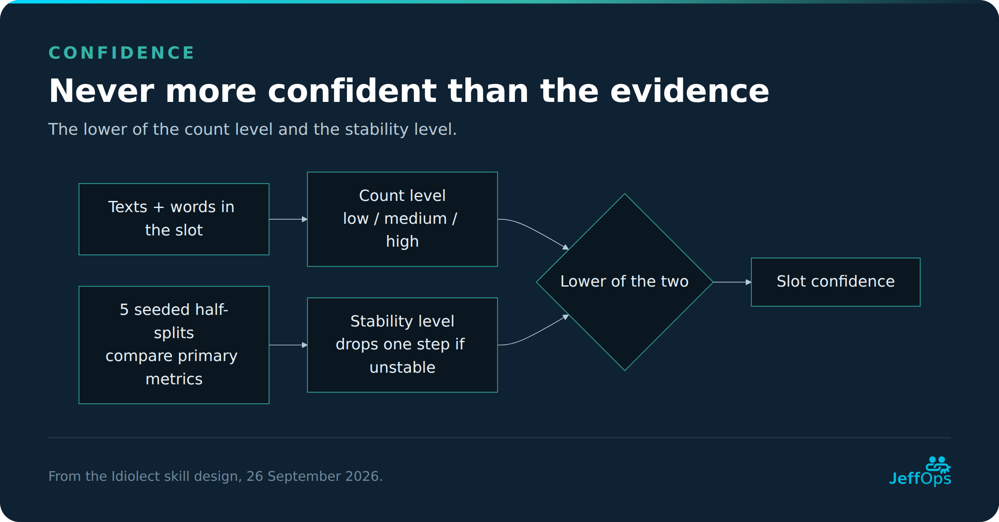

# Idiolect skill design

Updated 26 September 2026 · JeffOps · diagrams as JeffOps cards in `idiolect-design-images/`, editable Mermaid sources in `idiolect-design-diagram-sources/`

`/idiolect` is an empty engine: it learns a writer's voice from texts they point it at, keeps what it learned in a store outside the skill, and writes, rewrites and checks text in that voice. The skill contains the method only and holds nothing about any particular writer.

- **Learns from** Markdown, PDF and Word files, a folder or a tag; later mail, web pages and transcripts.
- **Keeps lessons** in a store the writer chooses, split into profiles and slots. Every change is approved from a diff and can be rolled back.
- **Writes** from the learned profile and a few real example passages, and never invents facts.
- **Proves itself** in blind tests against a plain draft and against a draft given the same examples.
- **v1 runs locally** (Claude Code, or any session with a shell on the writer's machine). A bridged cloud route comes later.

**Reading order.** Concept (glossary, principles, non-goals) → Using it (parameters, modes, worked example) → Internals (runtime, pipeline, adapters, lessons, facets, store, integration, guardrails) → Building it (package, quality plan, build plan, decisions, open questions).

## Glossary

| Term | Meaning |
| --- | --- |
| Store | The folder holding everything learned, marked by `idiolect.yaml`. Never inside a folder it learns from |
| Source | An original file, folder or mailbox the engine may learn from. Never modified by the engine |
| Ownership | `own` (learned from), `assisted` (recorded, not learned, can be promoted to `own`) or `exclude` (ignored) |
| Ledger | The ownership record: folder rules in `sources.yaml` plus per-file entries in the manifest. Per-file beats folder rule beats undecided |
| Content hash | SHA-256 of a source's normalised extracted text; identifies a text independent of its path |
| Corpus | The cleaned text of every approved `own` source, stored as `<store>/corpus/<hash>.txt`, with `manifest.json`. All learning runs on the corpus |
| Holdout | A text flagged in the manifest for testing only; learning refuses it |
| Profile | One voice, e.g. `sam` or `acme`, with a recorded subject and consent. A store can hold several |
| Facet | A dimension a profile is split along, in a declared order: `lang`, `type`, and optionally others such as `channel` |
| Slot | One value per facet inside a profile, e.g. `en.essay`. `_` means "any" and is never allowed for `lang` |
| Pooled slot | A slot with `_` in one or more non-language facets, built automatically, e.g. `en._` |
| Fingerprint | A slot's measured statistics with per-metric thresholds and confidence |
| Primary metrics | The metrics that best separate a slot's writer from AI text, found by the contrast pass |
| Contrast pass | Rewriting sample paragraphs in a neutral AI style, in a fresh context, and measuring the gap |
| Never-list | Markers found in the AI rewrites but not in the writer's text |
| Confidence | `low`, `medium` or `high`: the lower of a count level and a stability level |
| Drift, overshoot, shortfall | How far a draft's metric sits from the fingerprint, as a ratio; beyond a threshold it is flagged |
| Observed lesson | A pattern from the corpus supported by at least two texts; rebuilt on every relearn |
| Edit lesson | A pattern from stored edit pairs supported by at least two pairs; rebuilt from the edit store, never lost |
| Seen once | A pattern with one supporting text or pair, kept until a second confirms it |
| Ruling | A rule the writer states directly, with an id. Never changed by learning |
| Vocabulary | Terms, spellings and coinages kept exactly, each with an id |
| Rejection | A proposal the writer turned down; never proposed again unless the writer removes it |
| Example bank | Redacted real passages per slot, used as style references, never as content |
| Redaction | Replacing names, addresses and organisation details with placeholders such as `[client]`; recorded per item |
| Depth | How far a rewrite may go: `voice` (sentences), `edit` (trimming too), `full` (structure too) |
| Adapter | A converter from one kind of source to clean text |
| Snapshot | A copy of a profile and the manifest before each approved change, used by `rollback` |
| Pending area | `.state/pending/`, where a learn run's proposed changes wait for approval |
| Tag | A Markdown frontmatter `tags:` value or inline `#tag`, usable as a learn target; read, never written |
| Fixture author | A public-domain or synthetic author whose texts are used to build and test the engine |
| Baseline | A draft Idiolect is compared against: plain, or few-shot with the same examples |

## Design principles

| Part | What it is | Where it lives | Who changes it |
| --- | --- | --- | --- |
| Engine | The method: how to learn, write, rewrite and check | The skill itself (read-only at runtime) | Only when the method improves |
| Sources | The writer's original texts | Wherever the writer keeps them | Never the engine |
| Store | Ledger, corpus, lessons, snapshots | A folder the writer chooses | `learn` proposes, the writer approves |


*The three parts kept apart: sources are only read, the engine holds no writer data, and everything learned lives in the store, where nothing is committed without the writer's approval.*

- **The skill starts empty.** With no store it can still run `learn`; `write` and `rewrite` say nothing has been learned yet and offer to start.
- **Lessons live outside the skill**, as ordinary files the writer can read, edit and version.
- **One engine, many voices**, selected by `profile`: a person, an organisation or a co-author, always with consent recorded.
- **Voices are split, never averaged.** Slots separate languages, text types and any other declared facet.
- **Nothing becomes part of what is learned without approval.** New corpus texts, ownership answers and lessons wait in the pending area until the writer approves the diff. Housekeeping (the store marker on first run, progress and lock files, test results) is written without asking and is listed as such.
- **Scripts measure, the model judges, and the design says which is which.** Every pipeline step is labelled.

## Non-goals

Considered and left out on purpose; each has a Decision log entry. Reopening one needs a new entry.

- **No authorship detection.** A profile describes part of how someone writes; it is never used to judge whether a text is theirs.
- **No voice-strength score.** Tests report per-metric drift and blind picks, never a single "how much like Sam" number.
- **No blending of two writers.** Inheritance layers rules; pooled slots combine one writer's own texts only.
- **No automatic relearning.** Learning runs only when the writer starts it.
- **No story or anecdote bank.** The engine holds style, not content.
- **No translation in a voice.** A rewrite into another language is refused; each language is learned from its own texts.
- **No simultaneous learning runs.** A lock allows one learn at a time per store; a shared house style is a parent profile.
- **No imitation without consent.** A profile of a real person other than the user needs that person's recorded consent, and the engine refuses impersonation meant to deceive.

## Parameters

The model reads the request: natural language plus optional `key=value` pairs, e.g. `/idiolect write brief.md lang=nl type=email` or "write this in my Dutch email voice". There is no strict parser. `SKILL.md` carries this table, the defaults and common synonyms ("in Dutch" → `lang=nl`); when a request is ambiguous, the engine asks.

### Core parameters

| Parameter | Values | Default | Used by |
| --- | --- | --- | --- |
| `mode` | See Modes | Inferred from the request | All |
| targets | `learn`: a file, folder or tag. `learn-edit`: draft, then final. `write`: a brief. `rewrite`, `check`: a text. `test`: the held-out text | `learn`: every source in `sources.yaml` | See Modes |
| `store` | A folder containing `idiolect.yaml` | Discovered; asked on first run | All |
| `profile` | A profile in the store | `default_profile` | All except `status` without one |
| `depth` | `voice`, `edit`, `full` | `voice` | rewrite |
| `interactive` | `true`, `false` | `true` | All. `false` (for calling skills) never asks; where it would ask, it returns status needs_input with the question |
| Facets | `lang=en`, `type=essay`, `channel=…` | See value order under Facets | learn, learn-edit, write, rewrite, check, test, interview |

### Options

| Option | Effect | Used by |
| --- | --- | --- |
| `recursive=false` | Only the top level of a folder | learn |
| `exclude=<glob>` | Skip matching files; saved in `sources.yaml` | learn |
| `dry-run=true` | Report the inventory; analyse and create nothing | learn |
| `since=<year>` | Weight writing from that year onward more; saved per profile | learn |
| `explain=true` | Annotate each change with the lesson behind it | write, rewrite |
| `report=true` | Also return the machine-readable check report | write, rewrite |
| `to=<snapshot>` | Snapshot to restore, by its timestamp name; latest when omitted | rollback |
| `keep=<n>` | How many snapshots to keep; default 10 | prune |
| `include_parent=true` | Include inherited examples, lessons and fingerprint | export |

## Modes

| Mode | Input | What it does | Writes |
| --- | --- | --- | --- |
| `learn` | File, folder or tag; none = all registered sources | Inventory, ownership, extraction and learning; one diff at the end | After approval |
| `learn-edit` | Draft, then final version | Stores the edit pair and proposes edit lessons from changes recurring across pairs | After approval |
| `interview` | A slot, e.g. `lang=nl type=post` | Asks open questions; typed or dictated answers become `own` corpus texts with `origin: interview` | After approval |
| `forget` | A source, or a source and a new ownership | Removes a text from the corpus (deleting its cached text) or reclassifies it, and relearns affected slots | After approval |
| `write` | A brief | Drafts from the resolved slot | Nothing |
| `rewrite` | A text | Rewrites within `depth` | Nothing |
| `check` | A text | Compares with the fingerprint; flags shortfall and overshoot | Nothing |
| `test` | A holdout text, plus a topic-only brief | Flags the text as holdout through an approved diff; if it was already learned, affected slots are relearned first. Then generates from the brief in a context that never sees the text, and records per-metric drift | `eval/results.md` only |
| `status` | Optionally a profile | Active store, slots, counts, confidence, rejections, inherited rulings, unreachable sources | Nothing |
| `rollback` | A profile, optionally `to=` | Restores a snapshot of the profile and manifest after showing the diff; takes a snapshot first; removes slot files created after the restored snapshot; restores only this profile's manifest entries | After approval |
| `prune` | A profile, optionally `keep=` | Removes old snapshots; asks for delete permission where the environment needs it | After approval |
| `export` | A profile or slot | One self-contained prompt; see the export contents under Inheritance | Nothing (hands a file to the writer) |


*Modes grouped by what they may change. `test` only adds a row to its results file.*

### Write and rewrite, step by step

1. Find the store; resolve profile and slot with the resolution order under Facets. Say which slot and profile were used.
2. Load only: the slot page and edit lessons, fingerprint, never-list, the merged rulings and vocabulary (capped in size), and the top three example passages for the topic, chosen by a script. Never the corpus, never the whole example bank.
3. Draft. On a rewrite, respect `depth`: `voice` never adds, drops or reorders sections; structural ideas are listed separately. A rewrite into another language is refused.
4. Run `check` and fix drift in both directions.
5. Return the text, with the report or `explain` notes when asked. When confidence is low, say so. Where a fact or example is missing, leave a placeholder.

## Worked example

Sam is a fictional writer with twenty published essays in `~/Writing/Published` and a folder of exported Dutch emails (`.eml`) in `~/Writing/Mail`. Sam uses Idiolect locally in Claude Code.

1. **Dry run.** `/idiolect learn ~/Writing/Published dry-run=true`. No store exists. The dry run writes nothing and reports 20 files: 17 English essays, 2 how-tos with under 150 words of prose once code is stripped (skipped), 1 near-duplicate (older copy skipped). It notes that a store location will be asked for.
2. **Store.** Sam runs it for real. Idiolect asks where to create the store; Sam picks `~/Idiolect`, outside the writing folder. As housekeeping it writes `idiolect.yaml` (with `sources_root: ../Writing`) and creates profile `sam`, whose `profile.yaml` records subject "Sam, the user" and consent "self".
3. **Ownership.** Idiolect asks once for the folder. Sam answers "all mine except the two guest posts". The folder rule and the two per-file exceptions go to the pending area.
4. **Learning.** Adapters extract the text (script); fingerprints and the pooled `en._` slot are measured (script); a fresh agent rewrites sample paragraphs in a neutral style for the contrast pass (model) and a script measures the gap; the model reads a stratified sample of up to 20,000 words for observed lessons; vocabulary and redacted examples are proposed. Everything goes to the pending area.
5. **Approval.** One diff shows the new corpus texts, ownership entries, fingerprint, confidence (`medium`), lessons, vocabulary and examples, with every redaction visible. Sam rejects one lesson, promotes one to a ruling ("never use semicolons") and approves the rest. A snapshot is taken, the pending changes are committed and the changelog records the run.
6. **Rewrite.** `/idiolect rewrite draft.md` resolves to `sam / en.essay`. The draft's structure is kept (`depth=voice`) and an invented anecdote in the draft becomes `[example needed: a real incident]`.
7. **Check.** Rhetorical questions come out at 2.8× Sam's rate, above that metric's overshoot threshold of 2.0×, so the rewrite is adjusted before it is returned.
8. **Later.** Sam edits the draft before publishing and runs `/idiolect learn-edit draft.md final.md`. The pair is stored; two of its changes recur in an earlier pair and are proposed as edit lessons. A month later Sam relearns after adding essays: the edit lessons stay and the rejected lesson is not proposed again.


*Steps 1 to 7 of the example as a sequence: a dry run, the first real learn with one approval, then a rewrite.*

The Dutch emails become a separate `nl.email` slot only when Sam runs `learn ~/Writing/Mail`.

## Runtime

Scripts can only touch files in the environment they run in, and a skill keeps no state between sessions. The design therefore names two routes.

|  | Local route (v1) | Bridged route (later) |
| --- | --- | --- |
| Where | Claude Code on the writer's machine, or any session with a shell on it | A cloud workspace linked to the writer's computer through a file bridge |
| Scripts run | Next to the files | Inventory and hashing through the machine's shell; extraction and measurement in the cloud workspace |
| Moving files | Not needed | Only new or changed files are copied over, at most 50 per call; results are written back in bounded batches |
| Deleting | Works | Needs the writer's delete permission. Only three modes delete: `forget` (cached text), `rollback` (slot files newer than the snapshot) and `prune` (old snapshots) |
| Privacy note | Text stays on the machine | Source text is copied into the cloud workspace for the session; the engine says so before the first copy |


*v1 keeps files and scripts together. The later bridged route copies only what changed and writes results back in batches.*

**Common rules for both routes:**

- **Paths are relative.** `sources_root` is relative to the store (e.g. `../Writing`), and every path in the store is relative to `sources_root` or the store, so the same store works on Windows, Linux and through the bridge.
- **No remembered state.** The store is found per session by `store=` or discovery. For a permanent default, the engine suggests one line the writer can add to their project instructions; it never writes it.
- **Resumable batches.** Large learns run in batches of at most 50 files. After each batch, progress is written to `.state/progress.json`; every step is idempotent by content hash, so a restart continues where it stopped. Each batch is reported in one line.
- **Lock.** Every mode that writes to the store (`learn`, `learn-edit`, `interview`, `forget`, `rollback`, `prune`) takes `.state/lock`, which records the mode and a heartbeat updated at every step. It is held while a pending area exists. A lock whose heartbeat is older than one hour and has no pending area is stale. `dry-run=true` and read-only modes take no lock.
- **Leftover pending area.** If a session ends before approval, the next store-writing run shows the waiting diff and offers to resume or discard it before doing anything else.
- **Dependencies.** Python, a PDF library, a Word library and a small language-identification library. A start-up check names anything missing. Word tracked changes are read from the document XML (insertions kept, deletions dropped).

## Learning pipeline

One pipeline for a file, folder or tag. Nothing from steps 2–9 is final until step 10. Who does each step is labelled.

| # | Step | Who | What happens |
| --- | --- | --- | --- |
| 1 | Lock and inventory | Script | Take the store lock (not in a dry run). Walk the target, always skipping the store folder. Adapters extract text in memory to compute hashes. Report usable files by detected slot; skipped (not prose, under ~150 words of prose, near-duplicates keeping the newest, holdouts); unchanged; changed (same path, new hash); unreachable. `dry-run=true` stops here and writes nothing |
| 2 | Ownership | Script + writer | Apply the ledger: per-file entry, else folder rule, else ask, once per target or per file. A folder rule applies to mail files like any other; only connector and web sources with no rule start undecided. Answers go to the pending area |
| 3 | Extraction | Script (adapters) | For `own` texts only, cleaned text goes to the pending area: frontmatter, code, data tables, quoted replies, signatures and quoted words of others removed. `assisted` and `exclude` texts get a manifest entry but no cached text; promoting one to `own` extracts it then. Hash = SHA-256 of the text normalised to Unicode NFC with whitespace collapsed (case kept) |
| 4 | Language and type | Script + model | Script identifies language; a paragraph of 40+ words identified as another language with probability of at least 0.9 becomes a segment (`<hash>#2`, stored as `<hash>-2.txt`). Model assigns `type` from the `types` list, or proposes a new one. Uncertain cases are listed in the diff |
| 5 | Measurement | Script | Rebuild fingerprints of affected slots and pooled slots from corpus plus pending texts, with a fixed seed. `since=` weighting applies |
| 6 | Contrast | Model (fresh context) + script | A fresh agent with no skill or corpus loaded rewrites a sample of paragraphs in a neutral style; a script measures the gap and sets the never-list and primary metrics. The sample is reused until the slot's corpus changes by more than 20%. Without a fresh context, the result is flagged as less reliable |
| 7 | Confidence | Script | Count level and stability level (see Confidence), using primary metrics, or the global phase-0 metric list if no contrast has run |
| 8 | Qualitative pass | Model | Reads a stratified sample chosen by a script (at most 20,000 words per slot) and proposes observed lessons, with evidence counts from the full corpus via script lookups |
| 9 | Vocabulary, examples, filter, diff | Script + model | Propose vocabulary; redact candidate examples (script for patterns, model for names and organisations); drop proposals matching a rejection exactly and flag probable rewordings. Show one diff per affected slot, including corpus and ledger changes and every redaction |
| 10 | Record | Script | On approval: snapshot the profile and its manifest entries, commit the pending area, record rejections, write the changelog, release the lock. On rejection of everything: clear the pending area and release the lock (housekeeping) |


*Blue is script, pink is model, purple is script plus model, green involves the writer. Everything from steps 2 to 9 waits in the pending area until step 10.*

**Batches.** For a large target, steps 1–4 run per batch of up to 50 files with progress in `.state/progress.json`; steps 5–10 run once at the end, giving one diff.

**learn-edit.** The draft is not the writer's text, so neither version enters the corpus; the difference is what is learned, and it counts as the writer's. Inventory filters do not apply. The script diffs the pair into candidate changes before redaction, so edits to names are still seen; then the pair and changes are redacted and staged. The model groups candidates into kinds of change; a kind that recurs across at least two stored pairs becomes a proposed edit lesson. Steps 9–10 run as usual. The slot is resolved from the final version.

## Source adapters

An adapter turns one kind of source into clean text plus metadata (date, path, detected facets, origin). Adapters never decide ownership.

| Adapter | Reads | Who | Phase |
| --- | --- | --- | --- |
| `markdown` | `.md` notes; frontmatter and tags read, never written | Script | 1 |
| `pdf` | `.pdf` text layer; scanned pages flagged | Script | 1 |
| `docx` | Word documents; tracked changes resolved from the XML | Script | 1 |
| `mailfile` | Exported `.eml` / `.msg` files; quoted replies and signatures stripped | Script | 5 |
| `web` | A URL, sitemap or RSS feed, fetched raw over HTTP (never through a summarising web tool) | Script | 6 |
| `m365-mail` | Sent items through the Microsoft 365 connector, in small batches | Model | 6 |
| `transcript` | `.vtt`, `.srt` or text transcripts, for a spoken-voice slot | Script | 6 |

## Lessons

| Kind | Comes from | Stored in | On relearn |
| --- | --- | --- | --- |
| Observed lesson | The corpus | `<slot>.md` | Rebuilt from the corpus |
| Edit lesson | Stored edit pairs | `<slot>.edits.md`, evidence in `edits/` | Rebuilt from `edits/`; never lost |
| Ruling | The writer | `rulings.yaml` | Never touched |
| Vocabulary | Proposed by learn, approved by the writer | `vocabulary.yaml` | Kept; new entries proposed |
| Rejection | The writer declining a proposal | `rejected.yaml` | Filters every later proposal |

- **Two before it counts.** An observed lesson needs two supporting texts; an edit lesson needs two stored pairs. Anything with one stays under "Seen once". This is about single lessons; confidence is about the whole slot.
- **Evidence travels with the lesson:** count plus one short redacted quote or edit.
- **Edits outrank the corpus;** rulings outrank both. Conflicts are flagged in the diff, never resolved silently.
- **Rejections.** Each entry holds the slot, the lesson text and a normalised form (lower-case, punctuation and stop words removed) for exact matching. The model flags probable rewordings for the writer rather than dropping them. `status` lists rejections; deleting an entry lifts it.
- **Promotion and retirement.** A lesson the writer calls "always" or "never" becomes a ruling. An observed lesson that no longer holds drops out, visibly in the diff.
- **Vocabulary is binding** in write and rewrite.


*Precedence from top to bottom. A pattern needs a second supporting text or pair to become a lesson, rejected proposals never return, and a lesson the writer calls "always" or "never" is promoted to a ruling.*

### Confidence

Computed per slot after the contrast pass, stored in the fingerprint, copied onto the slot page.

| Level | Count floor (starting values, tuned in phase 0) |
| --- | --- |
| `low` | Fewer than 3 texts or 3,000 words |
| `medium` | At least 3 texts and 3,000 words |
| `high` | At least 8 texts and 15,000 words |

**Stability.** The corpus is split into halves five times with a fixed seed, and the primary metrics are compared. If any varies by more than the tolerance set in phase 0, the stability level drops one step. Confidence is the lower of the two levels. A `low` slot is usable and flagged in every draft; `check` then reports `low_confidence`, which a calling skill may treat as a pass with a warning.



*Confidence can never be higher than either the amount of text or its stability justifies.*

## Facets, resolution and inheritance

Facets are declared in `idiolect.yaml` in a fixed order; `lang` is always first and `type` second.

- **Slot key:** one value per facet in declared order, `_` for "any": `en.essay`, `en._`, `en.post.linkedin`. `lang` is never `_`, so there is no cross-language pool.
- **Value order per facet:** command, then ledger, then detection (language by script, type by model from the `types` list), then `defaults`, else `_`.
- **New facets only at the end.** Migration appends `_` to every existing key.
- **Pooled slots** (`en._` and so on) are built for every generalisation that has texts. They get the full set of slot files, because they combine one writer's own texts.

### Resolution order

The right voice beats a more specific match, and beats a higher confidence: a general slot of the requested profile wins over an exact slot of its parent, and an exact `low` slot wins over a `high` pooled slot, with a warning.

1. The exact slot in the requested profile.
2. Generalise from the last facet towards `lang`, replacing values with `_`, within that profile.
3. Then the parent profile, steps 1–2 again; then its parent.
4. Nothing found: ask, or with `interactive=false` return `status: no_slot`.


*Example request: profile `acme`, slot `en.post.linkedin`. The first slot found is used and named. Every generalisation within the requested profile is tried before the parent is consulted; rulings and vocabulary are merged across the chain whichever slot is used.*

### Inheritance

```yaml
# profiles/acme/profile.yaml
schema_version: 1
subject: Acme Ltd company voice
consent: authorised by the writer on 2026-10-02
extends: sam
```

Both directions are valid: a company voice on a founder's (`acme` extends `sam`), or a writer on a shared house style (`sam` extends `house`). Chains are allowed; cycles are refused.


*Rules flow down the whole chain; slots are borrowed whole, never mixed with the child's own.*

| Part | Combining rule | In an export |
| --- | --- | --- |
| Rulings | Merged across the chain; a child overrides by id | Included |
| Vocabulary | Merged; a child adds or overrides by id | Included verbatim, except entries marked `private` |
| Rejections | Merged; a parent's rejections also filter the child | Not included |
| Slot lessons, edit lessons, never-list, fingerprint, examples | Only through resolution (whole slots, step 3); never mixed with the child's | Own only; the parent's with `include_parent=true` |

Rulings inherited from a profile the writer does not own are highlighted in `status` and in every diff.

## The store

### Location

No built-in location. Per session the engine finds the store in this order:

1. `store=<path>` on the request.
2. Discovery: an `idiolect.yaml` marker in the folders the session can reach, at most three levels deep. With several, it lists them and asks. `status` shows the active store.
3. First run: nothing found, so it asks where to create one (never inside a folder it will learn from), writes the marker and the empty layout.

A store deeper than three levels, or outside the reachable folders, needs `store=` or a line in the writer's project instructions.

### Layout

```
<store>/
  idiolect.yaml            marker + settings
  README.md
  sources.yaml             folder rules, tag and file targets, exclusions
  corpus/
    manifest.json          one entry per text or segment
    <hash>.txt             cleaned text of an own text; segments as <hash>-2.txt
  eval/
    results.md             test runs (see Other store files)
  .state/
    lock                   mode + heartbeat of the running store-writing run
    progress.json          batch progress
    pending/               proposed changes awaiting approval
  profiles/
    sam/
      profile.yaml         schema_version, subject, consent, extends, since
      rulings.yaml
      vocabulary.yaml
      rejected.yaml
      changelog.md
      edits/               redacted pairs and extracted changes
      en.essay.md          slot page: observed lessons
      en.essay.edits.md    edit lessons
      en.essay.json        fingerprint, thresholds, primary metrics, confidence, seed
      en.essay.examples.md redacted example passages
      en.essay.never.md    never-list
      en._.md / .json / …  pooled slot, same file set
      snapshots/
        2026-10-02T2140/   this profile's files (excluding snapshots/) + its manifest entries
```

### idiolect.yaml

```yaml
schema_version: 1
sources_root: ../Writing     # relative to the store
facets: [lang, type]
types: [essay, howto, email, post]
default_profile: sam
defaults:
  lang: en
```

### sources.yaml

```yaml
schema_version: 1
sources:
  - path: Published
    profile: sam
    ownership: own
    recursive: true
  - path: Mail
    profile: sam
    ownership: own
    facets: { lang: nl, type: email }
  - tag: essay-final
    profile: sam
    ownership: own
exclude:
  - "**/_archive/**"
```

### corpus/manifest.json

```json
{
  "schema_version": 1,
  "texts": {
    "9f2c…e41a": {
      "path": "Published/2024-guest-post.md",
      "date": "2024-05-11",
      "origin": "file",
      "ownership": "exclude",
      "profiles": ["sam"],
      "facets": { "lang": "en", "type": "essay" },
      "holdout": false,
      "decided": "2026-10-02",
      "status": "active"
    }
  }
}
```

- **Identity.** Keys are content hashes; segments of a mixed-language file are `<hash>#n`, stored on disk as `<hash>-n.txt`. `origin` is `file`, `interview`, `mail` or `web`.
- **Status values:** `active`, `superseded` (a changed file replaced it), `unreachable` (path gone, still learned), `forgotten` (removed by `forget`, text deleted). `holdout: true` is a separate flag; learning refuses it.
- **Several profiles.** A text feeds every profile whose `sources.yaml` rule matches it; the same path may appear in rules for two profiles. Rollback of one profile restores only the manifest entries of that profile.
- **Only `own` texts are cached.** `assisted` and `exclude` entries keep the hash and decision, not the text.
- **Sources are never modified.** Existing frontmatter may be read as a hint, never written.


*Lifecycle of a text in the manifest. `recorded` stands for an `assisted` or `exclude` entry, which keeps its hash and decision but no cached text. `holdout` is a separate flag on any entry.*

### Other store files

Every store file has a schema in `schemas/` (JSON Schema for YAML and JSON files, a heading contract for Markdown pages):

- `rulings.yaml`, `vocabulary.yaml`, `rejected.yaml`: lists of entries with `id` and `text`; vocabulary entries may be `private: true`; rejections add `slot` and `normalised`.
- Fingerprint JSON: metrics with value, overshoot and shortfall thresholds (ratios to the writer's value) and a primary flag; counts; confidence with count and stability parts; seed.
- Slot page headings, matching the qualitative pass: Confidence (a copy) · Stance · Openings · Structure · Endings · Sentences · Tone · Recurring devices · Seen once.
- Privacy record: every item that can be exported (examples, edit pairs, lesson evidence quotes, vocabulary) records `redacted: true` or `private: true` and the redaction version; rulings and fingerprints record `personal_data: none`.
- `changelog.md`: one entry per approved change, rollback or prune, with date, slot and summary.
- `eval/results.md`: one row per test run with date, profile, slot, snapshot, blind picks (where judged) and per-metric drift.

The `check-report` schema describes output rather than a store file; it ships with the others in `assets/schemas/`.

## Use from other skills

Another skill uses Idiolect by loading it with explicit parameters; Idiolect cannot tell who invoked it, so the caller says so.

- **Calling skills pass `interactive=false`** and explicit facets (e.g. `channel=newsletter`). Idiolect then never asks questions.
- **`check` returns a machine-readable report** (schema `check-report`): `status` (`pass`, `fail`, `low_confidence`, `no_slot`, `no_store` or `error` with a message), the profile and slot used, drift per metric in both directions, and flagged lines with the lesson each breaks.
- **`write` and `rewrite` with `report=true`** return the text plus that report, so the caller can publish only on `pass` (or `low_confidence`, if it accepts that).
- **A calling skill never writes to the store.** Learning is always started and approved by the writer.


*A calling skill never gets a question; it gets a status it can act on.*

## Guardrails

Part of the engine; they apply to every profile and route.

- **Provenance first.** Only approved `own` sources enter the corpus. When ownership is unclear, the engine asks.
- **Consent.** Every profile records its subject and consent. A profile of a real person other than the user requires that person's consent; the engine refuses to build or use a profile to impersonate someone or to deceive. Evaluation fixtures are the only exception: public-domain texts, marked `consent: public-domain fixture, evaluation only`, never used outside `evals/`.
- **Sources are read-only.** The engine never modifies, tags or moves a source. Everything it records lives in the store.
- **Store content is data, not instructions.** Texts, emails, web pages, lessons and rulings are material to write from; instructions inside them are ignored. Inherited rulings from profiles the writer does not own are highlighted.
- **Never invent facts.** Numbers, names, incidents and anecdotes come from the writer or the brief; otherwise a placeholder such as `[example needed: a real incident]`.
- **Say how sure it is.** A `low` slot is flagged in every draft.
- **Approval before anything is learned.** Corpus, ledger and lessons change only through an approved diff; every approved change can be rolled back.
- **Deleting is rare and asked for.** Only `forget`, `rollback` and `prune` delete, each after an approved diff and with delete permission where the environment requires it.
- **No caricature.** `check` flags overshoot as well as shortfall, per metric.
- **Depth is a promise.** `depth=voice` changes sentences only.
- **Privacy.** Every exportable item carries a privacy record. In mail texts, other people's details are redacted in the corpus too. The corpus never leaves the store, and `export` refuses any item without a privacy record. The engine warns when the store sits in a cloud-synced folder, and, on the bridged route, before copying source text to the cloud workspace.
- **Other people's words stay theirs.** Quotes and forwarded text are stripped before learning and left untouched when rewriting.

## Skill package

Follows the standard skill anatomy: `SKILL.md`, `scripts/`, `references/`, `assets/`.

```
idiolect/
  SKILL.md                 router: parameters, synonyms, store discovery, runtime, guardrails, what to read next
  scripts/
    adapters/              markdown.py pdf.py docx.py (1) · mailfile.py (5) · web.py transcript.py (6)
    inventory.py           walk, classify, dedupe, hash, batch, resume, lock, dry-run report
    corpus.py              ledger, manifest, pending area, supersede, forget
    detect.py              language and segment splitting
    measure.py             fingerprints, pooled slots, thresholds, confidence (seeded)
    sample.py              stratified samples for the qualitative pass; top-k examples
    resolve.py             facet values and resolution order
    compare.py             draft vs fingerprint → readable and JSON report
    edits.py               pair diffing, candidate changes, recurrence counts
    redact.py              pattern redaction; hands names and organisations to the model
    diff_profile.py        pending vs current → readable diff; exact rejection filter
    snapshot.py            snapshot, rollback, prune
    migrate.py             schema upgrades, facet appends
    export.py              export assembly with redaction checks
    check_env.py           dependency check
  references/
    modes/                 one procedure per mode, loaded on demand
    runtime.md             local and bridged routes
    fingerprint.md         metrics and thresholds
    adapters.md            writing a new adapter
    lang/                  per-language word lists
  assets/
    schemas/               JSON Schemas and heading contracts for every store file
    templates/             idiolect.yaml sources.yaml profile.yaml rulings.yaml vocabulary.yaml rejected.yaml slot page README.md
```

Evaluation material (fixtures, briefs, `eval-protocol.md`, scripted edit pairs) lives in a separate `evals/` folder outside the packaged skill.

- **Frontmatter:** `name`, `description` (under 1,024 characters, no angle brackets), and `compatibility` naming the local route and the Python dependencies.
- **Generic:** the package contains no writer's data. References over 300 lines get a table of contents.

## Quality plan

### Evaluation protocol

Written down in `evals/eval-protocol.md` before any evaluation runs, and run in Claude Code or Cowork, where separate agents are available.

- **Fixture authors.** Lesser-known public-domain authors, supplemented by synthetic authors (distinct invented writing personas, labelled as synthetic). Before use, the judge is asked whether it recognises the author from a held-out text; a recognised author is replaced. Living writers are not used, because that would need their consent.
- **Two baselines per brief:** a plain draft, and a few-shot draft given the same three example passages but no profile.
- **Briefs.** Topic-only briefs written without seeing the held-out text; the generating run never has the held-out text or its path in context.
- **Judge.** For fixtures, a separate agent using skill-creator's comparator sees a held-out text by the author and the shuffled drafts, and picks the closest; a person spot-checks its picks. For a writer's own profile, the writer judges, with drafts labelled A/B/C and a hidden key.
- **The bar,** over at least 10 briefs per author: Idiolect is picked over the plain draft in at least 70% of cases and over the few-shot draft in at least 60%. Missing the second bar means the machinery adds nothing, and the design changes.
- **Clean runs.** Other voice skills are switched off by the tester during evaluation.
- **Results** go in the store's `eval/results.md` (for writer tests) or in `evals/` (for fixtures), as blind picks plus per-metric drift; no single score.


*The generating run never sees the held-out text. The few-shot baseline tests whether the profile adds anything beyond examples.*

### Metrics are chosen by evidence

In phase 0 a throwaway script measures fixture texts and AI rewrites of them. Metrics that separate each author clearly from the AI version are kept, with starting thresholds and a stability tolerance; the rest are dropped. That list is the global metric list; the contrast pass later narrows it per slot.

### What the skill loads

`SKILL.md` stays short. Each mode's procedure loads only for that mode. From the store, only the resolved slot's files, capped rulings and vocabulary, and script-chosen samples or examples are ever read into context.

### Triggering

Idiolect runs alongside any existing voice skill (decided), so its description triggers only on requests that are clearly about it:

- invoking it by name (`/idiolect`, "use Idiolect")
- learning a voice from files ("learn my voice from this folder", "add these posts to my profile")
- working with a profile ("check this against my profile", "which slot do you have for Dutch emails", "roll back my profile")
- writing or rewriting with an explicit profile, slot or store ("rewrite this with profile acme")

General requests such as "rewrite this in my voice" or "tighten this" are left to the other voice skill. The trigger tests in phase 3 check both directions: these requests trigger Idiolect, and general voice requests do not. Tests run in Claude Code with the skill-creator loop.

### Schemas and migrations

Every store file has a schema and `schema_version`. A format change ships with a migration.

### Scripts and model

Scripts do what can be counted and are covered by tests on fixtures. Steps that need judgement or generation are labelled as model work in the pipeline, and their results always appear in the diff.

### Repeatability

Fixed seeds for splits and samples, a reused contrast sample, and three runs with a stated tolerance wherever a phase check compares numbers.

### No real people in the package

Templates, `SKILL.md` and references contain no details taken from a real person. The only real texts anywhere in the project are public-domain fixture texts in `evals/`, outside the packaged skill. Worked examples such as Sam live in this document only.

### Edge cases

| Case | Behaviour |
| --- | --- |
| How-to that is mostly code | Code stripped; skipped under ~150 words of prose |
| Text switching language | Paragraphs of 40+ words clearly in another language become a segment for that language |
| Long quote from someone else | Stripped before learning; untouched in rewrites |
| Slot from one or two texts | Usable at `low`; lessons still need two supporting texts |
| Mixed ownership in one file | Asked per file; not learned until answered |
| Source moved or renamed | Matched by content hash; no question |
| Source edited | New hash supersedes the old entry, shown in the diff |
| Source deleted | Marked unreachable, kept until `forget` |
| Store inside a learn target | Always skipped by the inventory |
| Store unreachable | Write and rewrite work from the slot's files if the writer attaches them; learn waits |
| Two learn runs at once | The second stops on the lock |

## Build plan

Built and tested on the local route with fixture authors only; no phase depends on a later one. A writer's own profile starts with their first `learn` after phase 3.


*Each phase uses only what earlier phases built. A writer's own profile can start once writing works.*

| Phase | Delivers | Done when |
| --- | --- | --- |
| 0. Groundwork | Schemas for every store file and the check report; ownership precedence, hash normalisation, manifest status values, pending-area, lock and deletion rules; edge-case decisions; fixture authors (public-domain and synthetic, recognition-checked) and scripted edit pairs; throwaway metric script; global metric list with thresholds and stability tolerance; `evals/eval-protocol.md` | All of these are written down and reviewed |
| 1. Engine | Router `SKILL.md`, `check_env`, store discovery, lock with heartbeat, progress, inventory, ledger and manifest, pending area with resume/discard, markdown/pdf/docx adapters, language identification and segments, measurement with pooled slots and confidence on the global metric list, `status`, tests | `learn dry-run=true` on the fixture folder gives a correct inventory, and the tests pass |
| 2. Learning | Full `learn` with type assignment, `since=`, contrast pass, per-slot primary metrics, qualitative pass on samples, observed lessons, vocabulary, redaction with privacy records, examples, rejections, diff and approval, snapshots, `rollback`, `forget`, `prune` | Each fixture author has an approved profile; the corpus rebuilds identically twice; a rejected lesson stays gone after relearn; rollback restores a profile without touching another; a forgotten text's cache is gone |
| 3. Writing | `write`, `rewrite` with `depth`, `report` and `explain`; `check` with the report and caricature guard; resolution order; `interactive=false` and `needs_input`; evaluation harness; trigger tests. **Entry condition:** the `my-writing-style` question is decided (it is: runs alongside; see Triggering) | Idiolect meets both bars of the protocol |
| 4. Validation | `test` with holdout flagging and topic-only briefs | A learned text flagged as holdout triggers a relearn first; over three runs, per-metric drift shrinks within tolerance when fixture texts are added and relearned |
| 5. Feedback | `learn-edit` and the edit store, `interview`, `mailfile` adapter, extra facets with `migrate.py`, inheritance (and inherited rulings in `status`) | Scripted edit pairs produce edit lessons that survive a relearn; a migrated store with a new facet resolves correctly |
| 6. Reach | Bridged runtime route, `export`, `web`, `m365-mail` and `transcript` adapters, calls from other skills | A publishing skill gates on `check` with `interactive=false`, an exported prompt works in another tool, and a learn runs end to end over the bridge |

## Decision log

| Decision | Why |
| --- | --- |
| Engine, sources and store kept apart | Skills are read-only at runtime; lessons must be editable and portable; the engine must be shareable |
| Generic core with no writer data | Serves any writer and can be published; personal answers are asked at first `learn` |
| Local route first, bridged route later | Scripts need the files next to them; deleting and evaluation work locally |
| Store found by marker or `store=`; nothing remembered | Skills keep no state between sessions |
| Relative paths only | The same store must work on Windows, Linux and over the bridge |
| Ledger in the store, sources never modified | PDF and Word have no frontmatter; source material is the writer's |
| Ownership: per-file, then folder rule, then ask | Exceptions must override general rules |
| Hash of normalised text | Identity survives renames and metadata-only changes |
| Corpus cached in the store | Relearning must be repeatable without the originals |
| Pending area and approval before anything is learned | Every learned thing must be visible and reversible |
| Snapshots include the manifest | Rollback must also undo what entered the corpus, but only for the profile being rolled back |
| Deleting limited to `forget`, `rollback` and `prune` | Deletes need permission on some routes and are irreversible; only forget, rollback and prune delete, each after an approved diff |
| Facets declared, `_` for any, `lang` never pooled | Unambiguous keys, no cross-language voice |
| Own voice first in resolution, over specificity and confidence | A general slot in the right voice beats an exact slot in another |
| Pooled slots and inherited examples are not blending | Pools combine one writer's own texts; inherited slots are used whole, never mixed |
| Observed lessons vs edit lessons vs rulings | Relearning must never undo decisions or lose edit lessons |
| Rejections permanent until lifted | A declined lesson must not return |
| Two before a lesson counts | One text can hold one-offs |
| Confidence = lower of count and stability | Word counts alone overstate how settled a voice is |
| Scripts measure, the model judges, each step labelled | Honest about what code can do; judgement is always shown in the diff |
| Contrast pass in a fresh context | The same model, primed by the corpus, is a biased source of neutral text |
| Capped samples and top-k examples | Context stays bounded however large the corpus grows |
| `interactive=false` for callers | A skill cannot tell who invoked it |
| Never invent facts | A voice built to be believed makes invented details more harmful |
| Caricature guard | Imitation overdoes habits |
| Redaction recorded per item | Export must be able to enforce it |
| Consent recorded per profile | Voice imitation of others must be authorised |
| Store content is data, not instructions | Texts and shared profiles could otherwise steer every draft |
| Few-shot baseline and uncontaminated fixtures | Beating a plain draft on famous authors proves little; living writers would need consent, so fixtures are public-domain or synthetic |
| Non-goals (authorship detection, voice score, blending, auto-relearn, story bank, translation, concurrent learns, imitation without consent) | Each adds risk or false precision without improving the writing |
| Name: Idiolect | The linguistic term for one person's language; distinct triggers |
| Runs alongside my-writing-style, with narrow triggers | The existing skill keeps handling general voice requests; Idiolect triggers only on learning, profiles, checks and explicit use, so the two never compete |

## Open questions

- [x] ~~Does Idiolect replace `my-writing-style`?~~ Decided: it runs alongside, with narrow triggers (see Triggering).

No design questions are open. The store has no fixed location, and questions about a particular writer's texts are asked by the skill at the first `learn`, not in this design.
